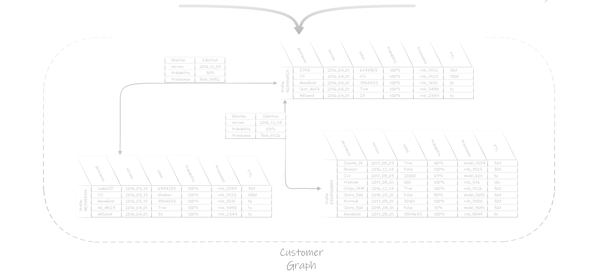

# Data Representation

Data about prospect and customers often comes in two forms: On the one hand there is data that represents an individual and his belongings from the point of view of the organization. This is what we call Declarative Data and mostly see stored in `Systems of Record`. On the other hand there is data that is being tracked \(or not\) about how individuals interact with the various touchpoints of the organization. This is what we call Behavioral Data and typically originates from `Systems of Engagement`.

