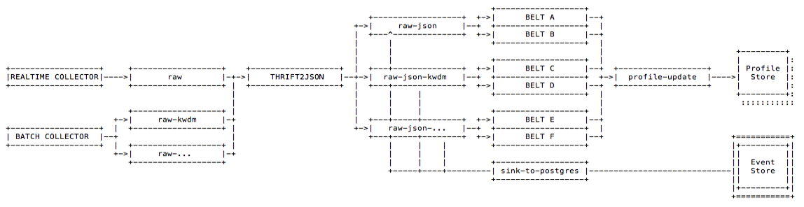

# Event Store

## Table `'eventstore'`



| Key | Description |
| :--- | :--- |
| **correlationid**  | groups all events that belong to the same tracking entity \(cookie, device, customer, contact, claim, etc.\) . Part of the Primary Key. |
| **eventid**  | used to deduplicate events. Part of the Primary Key. |
| created  | the timestamp of the original event creation |
| message  | the original payload of the event as it was ingested into Granary encoded as JSON. |



| correlationid | eventid | created | message |
| :--- | :--- | :--- | :--- |
| id\_8714343 | bfa9c1f5-7ae0-4c92-a067-d4ef9fe3927f | 1542020155031 | { "body": "{ ... }", "userAgent": "Mozilla/5.0 \(Windows NT 10.0; Win64; x64\) AppleWebKit/537.36 \(KHTML, like Gecko\) Chrome/67.0.3396.99 Safari/537.36" } |



