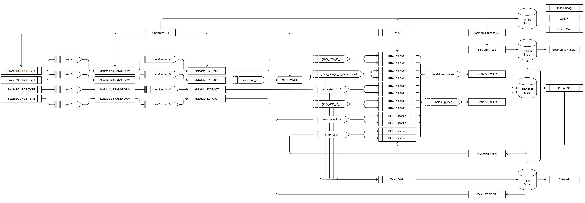

# Data Flow

## Legend:

* rectangular boxes denote micro services
* arrow boxes denote Apache Kafka topics
* storage boxes denote PostgreSQL database tables
* arrows between boxes denote directed data flow

