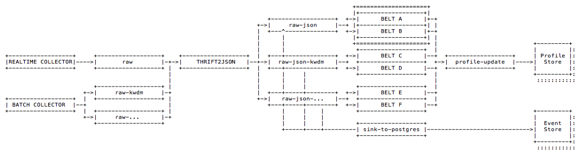

# Belt Extractor



Belts are used to compute updates for the Costumer Graph stored in the Profile Store. These updates can represent things like:

* whether a certain user has reached a goal in a conversion funnel
* what device type or operating system was used for the most recent visit
* when the most recent visit happened
* the increment on a counter that represents the number of visits per week
* a link between an anonymous session profile and an authenticated user
* the addition of a contract the user has and what the value of that contract is
* etc.

They are defined by a label, a scale factor, an input topic and a stateless / serverless Python function that gets invoked for every event received from the respective input topic. The function typically extracts data from the payload in order to compile one or more update statements for the Profile Store.

## Input Topic`'raw-json'`



| Key | Description |
| :--- | :--- |
| metadata | Kafka specific fields |
| payload | Forwarded from input attribute `value`  |
| $$-$$ schema | Snowplow Event Schema Reference |
| $$-$$ ipAddress | ipAddress if Snowplow is configured to collect this |
| $$-$$ timestamp | time of event creation or reception\(?\) |
| $$-$$ collector | identifies the source platform of the event |
| $$-$$ body | Snowplow Event Data \(according to `schema`\) |
| $$-$$ headers | HTTP headers |
| payload\_id | attributes extracted from payload.body |
| $$-$$ correlation\_id | used to group events received from the same tracking entity. |
| $$-$$ event\_id | used to deduplicate events |
| $$-$$ created | used to recreate the original order of events |
| $$-$$ event\_type | extracted from event payload or a static value |
| $$-$$ event\_harvester | name of the harvester instance, extracted from event payload or a static value |



```javascript
{
	"metadata": "{\"headers\": null, \"topic\": \"raw\", \"partition\": 0, \"key\": \"9417415d-7359-4ad0-8c3b-46ff4ca78c44\", \"timestamp\": [1, 1540748298485], \"offset\": 1746229}",
	"payload": {
		"body": "{ ... }",
		"collector": "ssc-0.13.0-kafka",
		"encoding": "UTF-8",
		"headers": ["Host: aws-eu1.grnry.io", "Accept: text/html, application/xhtml+xml, application/xml;q=0.9, image/webp, image/apng, */*;q=0.8", "Accept-Encoding: gzip, deflate, br", "Accept-Language: de-DE, de;q=0.9, en-US;q=0.8, en;q=0.7", "Cookie: _ga=GA1.2.1323636424.1533625971; ajs_anonymous_id=%22058bbd8d-cb74-47e4-aa27-9cc5fa4546aa%22; ajs_group_id=null; ajs_user_id=%22QjAVZpXa7qgJdZs6vGsNMA5M9yH3%22; mp_96b84420a1a32e448f73e7b9ffccebdb_mixpanel=%7B%22distinct_id%22%3A%20%22165133b330da0-0ad91354656274-47e1039-1fa400-165133b330f15e%22%2C%22%24initial_referrer%22%3A%20%22%24direct%22%2C%22%24initial_referring_domain%22%3A%20%22%24direct%22%7D", "Upgrade-Insecure-Requests: 1", "User-Agent: Mozilla/5.0 (Windows NT 10.0; Win64; x64) AppleWebKit/537.36 (KHTML, like Gecko) Chrome/67.0.3396.99 Safari/537.36", "X-Forwarded-For: 82.207.192.113", "X-Forwarded-Port: 443", "X-Forwarded-Proto: https", "Connection: keep-alive", "Timeout-Access: <function1>"],
		"hostname": "aws-eu1.grnry.io",
		"ipAddress": "82.207.192.113",
		"networkUserId": "631b9979-16b8-44ed-87b1-86b7d92d8223",
		"path": "/i",
		"schema": "iglu:com.snowplowanalytics.snowplow/CollectorPayload/thrift/1-0-0",
		"timestamp": 1535972952029,
		"userAgent": "Mozilla/5.0 (Windows NT 10.0; Win64; x64) AppleWebKit/537.36 (KHTML, like Gecko) Chrome/67.0.3396.99 Safari/537.36"
	},
    {
      "payload_id" : {
         "correlation_id": "cookie_dW5kIG5pZW1hbHMgdmVyZ2Vzc2VuIGVpc2VybiB1bmlvbg==",
         "event_id": "819f785b-82f7-4994-bbd8-992c94bdf7bc",
         "created": 1541345852941,
         "event_type": "web"
         "event_harvester": "snowplow_js"
      }
    }
}
```



## Configuration



#### Label

The label of the Belt needs to be unique and will be used as part of the distribution and container labels in Kubernetes.

#### Scale Factor

The number of containers that should be used to execute this Belt. As long as sufficient capacity is available in the system Kubernetes will ensure that the requested number of instances is maintained even if pods get decomissioned etc. 

#### Input Topic

The name of the Kafka topic this Belt will receive events from. Topics are typically designated by event type, so the consuming belt can assume a fixed schema.

#### Python callback function

The Python code provided here has to be in the form of a function by the name **callback.py** that can be invoked using the signature `execute(event)`where the parameter `event` is a dict containing one event from the input topic. The `belt-...` parameters provide context information about the belt instance.

The function is expected to return an [Update ](https://gitlab.alvary.io/grnry/belt-extractor/blob/master/grnry/beltextractor/update.py)object representing an update to a profile in the profile store, following below schema:

```text
UPDATE :=
  {
    "_schema": string,                                          # schema of update message, default is "update_2"
    "_operation": "_set" | "_set_with_history" | "_delete",     # default is _set
    "_id": string,
    "_path": \[ string [,string]* \],                           # array of length >= 1
    "_value": GRAIN_VALUE                                       # ignored if (and only if) _operation is _delete
  }

```

Whereas _GRAIN\_VALUE_ is

```text
GRAIN_VALUE := 
  {
    "_v": string,                                    # string for now, arbitrary objects later
    "_c": double,                                    # default is 1
    "_in": long,                                     # default is now()
    "_ttl": string,                                  # period of time, https://en.wikipedia.org/wiki/ISO_8601#Durations, default is P100Y
    "_origin": string,                               # default is null
    "_reader": string                                # default is "_all"
  }
```

Based on the update object generated by the callback, a JSON update\(s\) will be written into the update topic. Every update object returned by this function must have **at least** the following attribute set: 

| Key | Description |
| :--- | :--- |
| \_id | Specifies the profile that should be updated |
| \_path | The path within the nested structure of a profile that should be updated. In case the path doesn't exist yet it will be created. |
| \_value | The value that should be set in the profile under the defined `_path`  |

If unspecified, default values will be used:

| Attribute Name | Value |
| :--- | :--- |
| \_\_path | Empty array \(\[ \]\) |
| \_\_id | Empty string \(''\) |
| \_\_value | Empty dictionary \({}\) |
| \_\_schema | update\_2 |
| \_\_operation | \_set |




```python
def execute(event):
    if event:
        try:
            from grnry.beltextractor.update import Update
            update = Update()
            update.set_id(event['ID'])
            update.set_path([
                    "sessions",
                    "duration"
                ])
            update.set_value(event['DURATION'])
            update.set_operation('_set_with_history')
            return update
        except ValueError:
            sys.stderr.write(sys.exc_info())
            return None
```


```

```



## Output Topic `'profile-update'`



see [https://gitlab.alvary.io/grnry/kafka-profile-update/blob/master/PROFILESPECS.md](https://gitlab.alvary.io/grnry/kafka-profile-update/blob/master/PROFILESPECS.md)

| Key | Description |
| :--- | :--- |
| \_schema | schema of update message, default is "update\_1" |
| \_operation | can be either `_set` or`_set_with_history`  or `_delete` or one array operation, defaults to `_set`, see [Profile Store](profile-store.md#component-profile-updater) |
| \_id | identifies the profile that should b updated with this message |
| \_path | The path within the nested structure of a profile that should be updated. In case the path doesn't exist yet it will be created. An array of length &gt;= 1 |
| \_value | The value that should be set in the profile under the defined `_path` Ignored if \(and only if\) `_operation` is `_delete` |



```javascript
{
  "_schema": "update_1",
  "_operation": "_set_with_history",
  "_id": "007",
  "_path": [
    "a2",
    "b1"
  ],
  "_value": {
    "_v": "22",
    "_in": "2018-09-24",
    "_c": 0.4,
    "_ttl": "P3M"
  }
}

```




