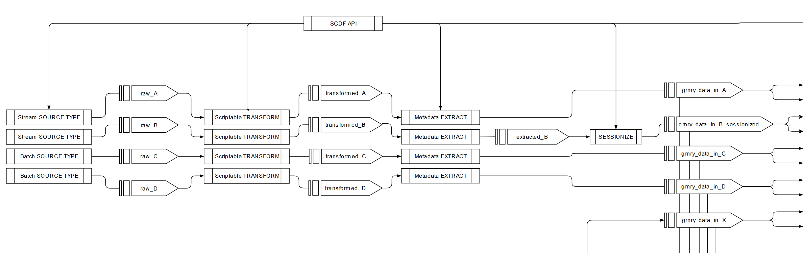

# Data-In



In this chapter, we are going to talk about the technical specificatoin of the data-in pipeline. Let us clarify some names shortly.

### SCDF

SCDF stands for Spring Cloud Data Flow and is the framework, GRNRY uses to get data into the plattform. We differentiate four different types of components.

### Source Types

The source type defines where the data comes from. It can be configured to suit your specific needs for input data. See [here](source-types.md).

### Scriptable Transform

The Scriptable transform is the transformation, where you can implement your custom logic for extraction, such as simple mappings. For more information on the scriptable transform, see [here](scriptable-transform.md).

### Metadata Extractor

The metadata extractor extracts information, such as the correlation ID, the event type or the harvester name from the payload and sets it to the header fields. Here, you basically need to define mappings in SpEL. More information on the [metadata extractor](metadata-extractor.md).

### EventStore Sink

The EventStore Sink persists data from the data\_in\_grnry\_&lt;event&gt; topic and persists it into the database. More information on the [Eventstore Sink](eventstore-sink.md).

### API Calls

Consult the [Granary Access Clients Reference](../../../operator-reference/identity-and-access-management/granary-access-clients.md#scdf) for roles a user needs to interact with SCDF API.

If you just want to have a quick look at the API calls, here they are. They are documented in more detail here: [Getting Started](../../../learning-grnry-1/data-in/how-to-run-a-harvester/getting-started.md)

Registering Apps:

```bash
curl -X POST -u <user>:<password> -d \
"uri=<docker-image-location>" \
https://<URL to SCDF>/apps/<type>/<name>/<version>
```

| Parameter | Content |
| :--- | :--- |
| &lt;user&gt; | Your technical user to connect to SCDF |
| &lt;password&gt; | Your password for the technical user of SCDF |
| &lt;docker-image-location&gt; | An encoded URL where the version of the application you want to register, resides. |
| &lt;URL to SCDF&gt; | URL to your SCDF instance. |
| &lt;type&gt; | Type of the application, e.g. source or sink |
| &lt;name&gt; | Name you want to register the application on. This is the name, you need to use in pipe definitions to refer to. |
| &lt;version&gt; | Optional parameter for a version, e.g. 0.5.1 or latest. |

Registering a pipeline:

```bash
curl <URL to SCDF>/streams/definitions?deploy=false \
 -d "name=<stream_name>&definition=<stream_definition>" \
 -u <user>:<password> -X POST
```

| Parameter | Content |
| :--- | :--- |
| &lt;URL to SCDF&gt; | URL to your SCDF instance |
| &lt;stream\_name&gt; | The name you want to define for the stream, e.g. `harvester_db1_all` |
| &lt;user&gt; | The technical user, you use to login to SCDF |
| &lt;password&gt; | The password for the technical user. |
| &lt;stream\_definition&gt; | The pipeline for the stream, e.g. `grnry-sftp | grnry-scriptable | grnry-data-in-metadata > :grnry_data_in_event` |

Deploying a pipeline:

```bash
curl <URL to SCDF>/streams/deployments/<stream_name> -i -X POST \
 -H "Content-Type: application/json" -u <user>:<password> \
 -d "{<json_encoded_parameters>}
```

| Parameter | Content |
| :--- | :--- |
| &lt;stream\_name&gt; | The na you have defined for the stream |
| &lt;user&gt; | The technical user, you use to login to SCDF |
| &lt;password&gt; | The password for the technical user. |
| &lt;json\_encoded\_parameters&gt; | The parameters you want to pass to the pipeline, such as configuration data. |

