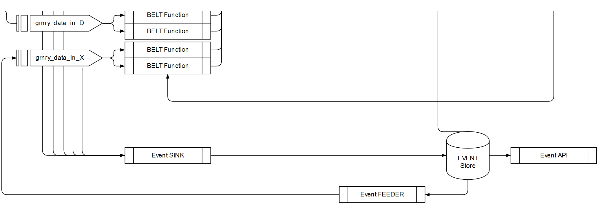

# Event Store and Replay

In the raw data zone of Granary, each message of an [Event Type](../../learning-grnry-1/data-in/how-to-run-a-harvester/event-types.md) is persisted in the Event Store table by the [SCDF Event Store sinks](data-in/eventstore-sink.md). Also, raw data can be replayed back into belts by the Event Feeder.

Data can be retrieved from Event Store using the [Event Store API](../api-reference/event-store-api.md).

## Table `eventstore`



| Key | Description | Data Type | Default | Null |
| :--- | :--- | :--- | :--- | :--- |
| **correlation\_id**  | Correlation-ID. Groups all events that belong to the same tracking entity \(cookie, device, customer, contact, claim, etc.\). | varchar | - | `NOT NULL` |
| **event\_id**  | Event-ID. Used to deduplicate events. | uuid | - | `NOT NULL` |
| created  | Created. The timestamp of the original event creation. | bigint | - | `NOT NULL` |
| message  | Message. The original payload of the event as it was ingested into Granary encoded as JSON. | jsonb | - | - |
| event\_type | Event type. Describes type of the event. The type is customizable in Metadata Extractor. This is used to control access to the event. `event_type` must not include "`_`". | varchar | `na` | `NOT NULL` |
| event\_harvester | Event harvester. Describes the source of the event. The source is the Granary Harvester of the event. This is used to control access to the event. `event_harvester` must not include "`_`". | varchar | `na` | `NOT NULL` |
| partition\_id | kafka partition the message was read from | bigint | - | `NOT NULL` |
| partition\_offset | partition offset the message was read from | bigint | - | `NOT NULL` |



| correlation\_id | event\_id | created | message | event\_type | event\_harvester | partition\_id | partition\_offset |
| :--- | :--- | :--- | :--- | :--- | :--- | :--- | :--- |
| 8714343 | bfa9c1f5-7ae0-4c92-a067-d4ef9fe3927f | 1542020155031 | { "body": "{ ... }", "userAgent": "Mozilla/5.0 \(Windows NT 10.0; Win64; x64\) AppleWebKit/537.36 \(KHTML, like Gecko\) Chrome/67.0.3396.99 Safari/537.36" } | web | snowplow | 20 | 225102 |



## Event Replay

Event Replay enables [belts](belt-extractor.md) to start at a certain point in time in the past and to resume consuming the live event feed after reprocessing the past events.

As depicted in the raw data zone chart  above, the replay data flow uses the component **Event Feeder** which reads raw events from the Event Store. The feeder emits those typed events to a temporary Kafka topic which can be consumed by the Belt extractor runtime.

### Event Feeder

Event feeder will create a batch job to read events based on configurable event type and send them to a user-defined Kafka topic. How many events to be ingested at every DB batch read is configurable. Spring batch creates metadata tables to control the job instances created. At that moment, the metadata are stored in the \(main\) database in tables prefixed with "BATCH\_".

| Parameter \(env variable name\) | Description | Example Value |
| :--- | :--- | :--- |
| EVENTSTORE\_HOSTNAME | hostname of the postgres instance | `grnry-pg-citus` |
| EVENTSTORE\_PORT | port of the postgres instance | `5432` |
| EVENTSTORE\_DB\_NAME | database name on postgres instance | `postgres` |
| IO.GRNRY.EVENTFEEDER.DATASOURCE-TABLE-NAME | table name on postgres instance | `public.eventstore` |
| IO.GRNRY.EVENTFEEDER.DATASOURCE-USER | username on postgres instance | `postgres` |
| IO.GRNRY.EVENTFEEDER.DATASOURCE-PASSWORD | password on postgres instance | `xxx` |
| IO.GRNRY.EVENTFEEDER.DATASOURCE-SSL | Whether database connection should use SSL | `false` |
| IO.GRNRY.EVENTFEEDER.DATASOURCE-SSL-VALIDATE | Whether server certificate should be validated at secure database connection | `false` |
| SPRING.KAFKA.BOOTSTRAP-SERVERS | Name of kafka service to connect to | `grnry-kafka` |
| IO.GRNRY.EVENTFEEDER.OUTPUT-TOPIC | Name of temporary output topic | `snowplow-temp` |
| IO.GRNRY.EVENTFEEDER.EVENT-TYPE | Batch size for DB read | `100` |
| ENCRYPTION\_MODE | Whether raw events should be encrypted in temporary output  topic | `false` |

### Replay Scenario 1 - Deploy new Belt, start few days back, no event feeding

* _1st Deployment:_ Belts consume their Kafka source topic not from offset `latest` but from a given offset, see [Belt API ](../api-reference/belt-api.md)parameter `offset`.
* No previous grains must be invalidated.

### Replay Scenario 2 - Deploy new belts, start on past event data

* Event Feeder reads raw events from Event Store and emits them to a temporary topic, settings see above.
* Event Feeder also determines a **Hand-over offset** to switch from temporary to live topic.
* _1st Deployment:_ Belts consume temporary topic from `earlist`. To achieve this, use [Belt API ](../api-reference/belt-api.md)parameter `offset` with zeros for all partitions.


Wait until processing of past events has been finished before starting with _2nd Deployment_.


* _2nd Deployment:_ Belts consume their live source topic not from offset `latest` but from the **Hand-over offset**, see [Belt API ](../api-reference/belt-api.md)parameter `offset`.


_2nd Deployment_ needs to be a new Belt definition in Belt API


* No previous grains must be invalidated.

