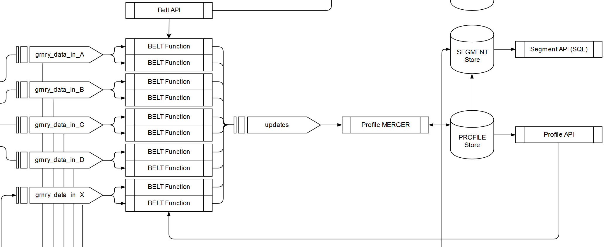

# Profile Store



The profile store holds integrated data for entities in so-called profiles. Such entities can be customers, customers' contracts or customers' behavior, etc. The profile store holds a profile for each correlation id and profile type. A profile type denotes the abstract notion of an entity, such as customer, contract, or behavior.

A profile is a JSON document. A profile consists of fragments and grains. Fragments group other fragments and grains. Grains store the information at different points in time. Grain values carry the actual value and respective meta information.

[https://gitlab.alvary.io/grnry/kafka-profile-update/blob/master/PROFILESPECS.md\#profile-specification](https://gitlab.alvary.io/grnry/kafka-profile-update/blob/master/PROFILESPECS.md#profile-specification)

## Table `profilestore`

The profile store is a distributed table in a database. Each tuple in that table represents some profile's grain at some point in time. A query to the `profilestore` table therefore retrieves a single grain value's information. The full nested JSON data structure that complies with above linked specification must be pulled via the Profile API.

`profilestore` table tuples consist of the following fields.



<table>
  <thead>
    <tr>
      <th style="text-align:left">Key</th>
      <th style="text-align:left">Description</th>
      <th style="text-align:left">Data Type</th>
      <th style="text-align:left">Default</th>
      <th style="text-align:left">Null</th>
    </tr>
  </thead>
  <tbody>
    <tr>
      <td style="text-align:left"><b>correlation_id </b>
      </td>
      <td style="text-align:left">Correlation ID. Groups all grains that belong to the same profile (cookie,
        device, customer, contact, claim, etc.). This is identical to the correlation-id
        in the Event Store.</td>
      <td style="text-align:left">varchar</td>
      <td style="text-align:left">-</td>
      <td style="text-align:left"><code>NOT NULL</code>
      </td>
    </tr>
    <tr>
      <td style="text-align:left"><b>profile_type</b>
      </td>
      <td style="text-align:left">Profile type. Describes the type of the profile.</td>
      <td style="text-align:left">varchar</td>
      <td style="text-align:left"><code>_d</code>
      </td>
      <td style="text-align:left"><code>NOT NULL</code>
      </td>
    </tr>
    <tr>
      <td style="text-align:left"><b>path</b>
      </td>
      <td style="text-align:left">Path. Denotes the grain&apos;s path in the profile&apos;s JSON data structure.
        The last past element defines the grain&apos;s name.</td>
      <td style="text-align:left">varchar</td>
      <td style="text-align:left">-</td>
      <td style="text-align:left"><code>NOT NULL</code>
      </td>
    </tr>
    <tr>
      <td style="text-align:left"><b>pit</b>
      </td>
      <td style="text-align:left">Point in Time. Captures the history of grains.</td>
      <td style="text-align:left">varchar</td>
      <td style="text-align:left"><code>_latest</code>
      </td>
      <td style="text-align:left"><code>NOT NULL</code>
      </td>
    </tr>
    <tr>
      <td style="text-align:left">value</td>
      <td style="text-align:left">Value. Stores the grain&apos;s value. Must be a JSON string or JSON array
        of strings.</td>
      <td style="text-align:left">jsonb</td>
      <td style="text-align:left">-</td>
      <td style="text-align:left"><code>NOT NULL</code>
      </td>
    </tr>
    <tr>
      <td style="text-align:left">certainty</td>
      <td style="text-align:left">Certainty. Describes the grain value&apos;s certainty.</td>
      <td style="text-align:left">real</td>
      <td style="text-align:left"><code>1.0</code>
      </td>
      <td style="text-align:left"><code>NOT NULL</code>
      </td>
    </tr>
    <tr>
      <td style="text-align:left">grain_type</td>
      <td style="text-align:left">
        <p>Grain type. Describes the grain&apos;s type. Naming convention:</p>
        <ul>
          <li>t == text</li>
          <li>a == array</li>
          <li>c == counter</li>
        </ul>
      </td>
      <td style="text-align:left">character</td>
      <td style="text-align:left">-</td>
      <td style="text-align:left"><code>NOT NULL</code>
      </td>
    </tr>
    <tr>
      <td style="text-align:left">inserted</td>
      <td style="text-align:left">Inserted. States the unix epoch timestamp in milliseconds when the grain
        was first inserted.</td>
      <td style="text-align:left">bigint</td>
      <td style="text-align:left">-</td>
      <td style="text-align:left"><code>NOT NULL</code>
      </td>
    </tr>
    <tr>
      <td style="text-align:left">ttl</td>
      <td style="text-align:left">Time to life. Allows to delete the grain after a defined duration. Format
        is <a href="https://en.wikipedia.org/wiki/ISO_8601#Durations">https://en.wikipedia.org/wiki/ISO_8601#Durations</a>.</td>
      <td
      style="text-align:left">varchar</td>
        <td style="text-align:left"><code>P100Y</code>
        </td>
        <td style="text-align:left"><code>NOT NULL</code>
        </td>
    </tr>
    <tr>
      <td style="text-align:left">reader</td>
      <td style="text-align:left">Reader. Authorizes the access to the grain. By default access is granted
        to all authenticated users.</td>
      <td style="text-align:left">varchar</td>
      <td style="text-align:left"><code>_auth</code>
      </td>
      <td style="text-align:left"><code>NOT NULL</code>
      </td>
    </tr>
    <tr>
      <td style="text-align:left">origin</td>
      <td style="text-align:left">Origin. Allows to trace the profile&apos;s origin.</td>
      <td style="text-align:left">varchar</td>
      <td style="text-align:left">-</td>
      <td style="text-align:left">-</td>
    </tr>
  </tbody>
</table>



```javascript
// retrieved via Profile API
{
  "_id": "0815",
  "a1": {
    "_latest": {
      "_v": "abc",
      "_c": 0.4,
      "_in": 123,
      "_ttl": "P100Y",
      "_origin": null,
      "_reader": "_all"
    }
  },
  "a2": {
    "b1": {
      "2018-09-21": {
        "_v": "21",
        "_c": 0.1,
        "_ttl": "P100Y",
        "_origin": null,
        "_reader": "_all"
      },
      "2018-09-22": {
        "_v": "22",
        "_c": 0.2,
        "_ttl": "P100Y",
        "_origin": null,
        "_reader": "_all"
      },
      "_latest": {
        "_v": "23",
        "_in": "2018-09-23",
        "_c": 0.3,
        "_ttl": "P100Y",
        "_origin": null,
        "_reader": "_all"
      }
    },
    "b2": {
      "_latest": {
        "_v": "123456",
        "_c": 0.4,
        "_in": "2018-09-20",
        "_ttl": "P100Y",
        "_origin": null,
        "_reader": "_all"
      }
    }
  },
  "a3": {
    "b3": {
      "c3": {
        "d3": {
          "e3": {
            "_latest": {
              "_v": "123456",
              "_c": 0.5,
              "_in": "2018-09-20",
              "_ttl": "P100Y",
              "_origin": null,
              "_reader": "_all"
            }
          }
        }
      }
    }
  }
}
```



## Component `Profile Updater`

Belts process input and create Profile Updates. The Profile Updater merges such Profile Updates into the Profile Store. These Profile Updates must follow the specification in [https://gitlab.alvary.io/grnry/kafka-profile-update/blob/master/PROFILESPECS.md\#profile-update-specification](https://gitlab.alvary.io/grnry/kafka-profile-update/blob/master/PROFILESPECS.md#profile-update-specification). Currently there are the following operations:

#### Operations

| Operation Name | Input Type | Output |
| :--- | :--- | :--- |
| _\_set_ | same type as grain type | inserts the current grain value at _\_latest_ and overwrites if it already exists. |
| _\_set\_if\_not\_exist_ | same type as grain type | inserts the current grain value at _\_latest_ only if it does not already exist. |
| _\_set\_with\_history_ | same type as grain type | inserts the current grain value at _\_latest_ and stores previous _\_latest_ grain value at its insert point in time if it already exists. |
| _\_set\_with\_history\_distinct_ | same type as grain type | will do a _\_set\_with\_history_ only if the new value is distinct from the existing value. |
| _\_delete_ | - | deletes the _\_latest_ grain value at the specified path. |
| _\_inc_ | _counter_ | creates or increments a counter. |
| _\_array\_append_ | _array_ | appends to the _\_latest_ array grain value considered as a bag semantics. |
| _\_array\_append\_with\_history_ | _array_ | appends to the _\_latest_ array grain value considered as a bag semantics and stores the previous _\_latest_ grain value at pit of insertion. |
| _\_array\_put_ | _array_ | adds an element to the _\_latest_ array grain value considered as a set \(i.e., unique elements\). Executed on a non-existing grain \(i.e., it is this grain's creation\) inserts the array as is \(i.e., without de-duplication\) |
| _\_array\_put\_with\_history_ | _array_ | adds an element to the _\_latest_ array grain value considered as a set \(i.e., unique elements\) and stores the previous _\_latest_ grain value at pit of insertion. |
| _\_array\_put\_with\_history\_distinct_ | _array_ | does an _\_array\_put\_with\_history_ only if the new value is distinct from the existing value. |
|  _\_array\_remove_ | _text_ | removes all elements matching the received string from the _\_latest_ array grain value. |
| _\_array\_remove\_with\_history_ | _text_ | removes all elements matching the received string from the _\_latest_ array grain value and stores the previous _\_latest_ grain value at pit of insertion. |

Each Profile Update carries the the grain value to be merged into the store. A grain value consists of the actual value, denoted as `_v`, and its meta information. \(Currently\) `_v` must be a JSON string or a JSON array of strings.

### Counter

The _`_inc` operation's `_v`_ must be of the form: `initialvalue|stepsize|steps`, e.g., `0|1|1`. This creates or increments counter grain values like `{"_initial":0, "_step":1, "_current":1}`. Please see the above linked spec. 


_**Example:**_ The value`"10|0.5|-1"` defines a single-step decrement of width `0.5` for a counter starting at value `10`.


| Parameter | Datatype | Description |
| :--- | :--- | :--- |
| `initialvalue` | real number | defines the counter's start value. |
| `stepsize` | real number | defines the width of each counter increment/decrement |
| `steps` | real number |  the number of increments/decrements to do |

### Arrays

For arrays, Granary offers operations for the in-place modification of grain values. These operation either consider the array as a set of values with distinct entries or as bag of values where duplicates may occur. All array operations can be run with or without the creation of history.

On an array modifications, existing grain value meta data \(`_reader, _ttl, _origin, _c`\) remain unchanged. The insertion time \(`_in`\) is updated.

See [https://gitlab.alvary.io/grnry/kafka-profile-update](https://gitlab.alvary.io/grnry/kafka-profile-update)

### Dead letter queue

In GRNRY, we have created so called _dead letter queues_. The Profile Updater's dead letter queue is used to receive all the data that could not be processed correctly.

By default the Profile Updater's dead letter queue is called: 

```yaml
profile-update-dead-letter
```

In order to rename it one must change the helm deployment parameter:

```yaml
kafka.deadLetterTopic: "profile-update-dead-letter"
```

#### When is something written to the Dead Letter Queue?

Profile Updater writes profile updates to dead letter queue in case of:

* operation does not fit to the grain type, e.g. if:
  * operation is `_inc` and grain type is not `counter`
  * operation is one of `array_append, _array_append_with_history, _array_put, _array_put_with_history` and grain type is not `array`
  * operation is one of `_array_remove, _array_remove_with_history` and grain type is not a literal \(`t`\)
* grain value \(`_v`\) may only be `null` for delete operation 
* certainty \(`_c`\) is not between 0 and 1
* creation timestamp \(`_in`\) is negative
* time to live \(`_ttl`\) does not comply ISO 860 time period
* time to live \(`_ttl`\) contains a negative number
* an update is made and the grain type in the profile update contains a grain type that differs from existing grain type in Profile Store

