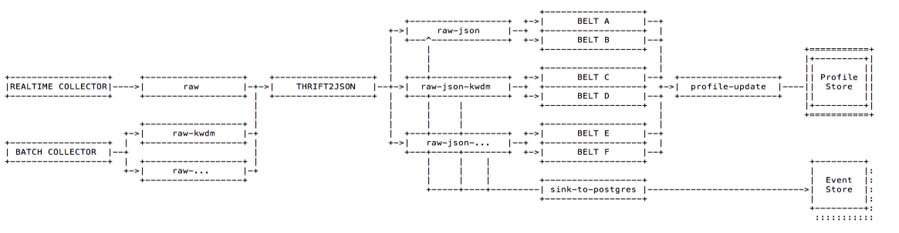

# Profile Store



## Table `'profilestore'`

A query to the `profilestore` table results in a nested JSON data structure that complies with [https://gitlab.alvary.io/grnry/kafka-profile-update/blob/master/PROFILESPECS.md\#profile-specification](https://gitlab.alvary.io/grnry/kafka-profile-update/blob/master/PROFILESPECS.md#profile-specification)

Each row in the `profilestore` table consists of a grain. All grains for a unique primary key results in a profile.



<table>
  <thead>
    <tr>
      <th style="text-align:left">Key</th>
      <th style="text-align:left">Description</th>
      <th style="text-align:left">Data Type</th>
      <th style="text-align:left">Default</th>
      <th style="text-align:left">Null</th>
    </tr>
  </thead>
  <tbody>
    <tr>
      <td style="text-align:left"><b>id </b>
      </td>
      <td style="text-align:left">Correlation ID. Groups all events that belong to the same tracking entity
        (cookie, device, customer, contact, claim, etc.). This is identical to
        the correlation-id in the Event Store.</td>
      <td style="text-align:left">varchar</td>
      <td style="text-align:left">-</td>
      <td style="text-align:left"><code>NOT NOLL</code>
      </td>
    </tr>
    <tr>
      <td style="text-align:left"><b>profile_type</b>
      </td>
      <td style="text-align:left">Profile type. Describes the type of the profile.</td>
      <td style="text-align:left">varchar</td>
      <td style="text-align:left"><code>_d</code>
      </td>
      <td style="text-align:left"><code>NOT NULL</code>
      </td>
    </tr>
    <tr>
      <td style="text-align:left"><b>path</b>
      </td>
      <td style="text-align:left">Path. Describes the grain&apos;s path in the profile&apos;s JSON data
        structure. The last past element defines the grain&apos;s name.</td>
      <td
      style="text-align:left">varchar</td>
        <td style="text-align:left">-</td>
        <td style="text-align:left"><code>NOT NULL</code>
        </td>
    </tr>
    <tr>
      <td style="text-align:left"><b>pit</b>
      </td>
      <td style="text-align:left">Point in Time. Allows historization of grains.</td>
      <td style="text-align:left">varchar</td>
      <td style="text-align:left"><code>_latest</code>
      </td>
      <td style="text-align:left"><code>NOT NULL</code>
      </td>
    </tr>
    <tr>
      <td style="text-align:left">value</td>
      <td style="text-align:left">Value. Stores the grain&apos;s value.</td>
      <td style="text-align:left">jsonb</td>
      <td style="text-align:left">-</td>
      <td style="text-align:left"><code>NOT NULL</code>
      </td>
    </tr>
    <tr>
      <td style="text-align:left">certainty</td>
      <td style="text-align:left">Certainty. Describes the grain value&apos;s certainty.</td>
      <td style="text-align:left">real</td>
      <td style="text-align:left"><code>1.0</code>
      </td>
      <td style="text-align:left"><code>NOT NULL</code>
      </td>
    </tr>
    <tr>
      <td style="text-align:left">grain_type</td>
      <td style="text-align:left">
        <p>Grain type. Describes the grain&apos;s type. Naming convention:</p>
        <ul>
          <li>t == text</li>
          <li>a == array</li>
          <li>c == counter</li>
        </ul>
      </td>
      <td style="text-align:left">character</td>
      <td style="text-align:left">-</td>
      <td style="text-align:left"><code>NOT NULL</code>
      </td>
    </tr>
    <tr>
      <td style="text-align:left">inserted</td>
      <td style="text-align:left">Inserted. States the timestamp when the grain was first inserted. Format
        is milliseconds since Unix Epoch.</td>
      <td style="text-align:left">bigint</td>
      <td style="text-align:left">-</td>
      <td style="text-align:left"><code>NOT NULL</code>
      </td>
    </tr>
    <tr>
      <td style="text-align:left">ttl</td>
      <td style="text-align:left">Time to life. Allows to delete the grain after a defined duration. Format
        is <a href="https://en.wikipedia.org/wiki/ISO_8601#Durations">https://en.wikipedia.org/wiki/ISO_8601#Durations</a>.</td>
      <td
      style="text-align:left">varchar</td>
        <td style="text-align:left"><code>P100Y</code>
        </td>
        <td style="text-align:left"><code>NOT NULL</code>
        </td>
    </tr>
    <tr>
      <td style="text-align:left">reader</td>
      <td style="text-align:left">Reader. Authorizes the access to the grain. By default access is granted
        to all authenticated users.</td>
      <td style="text-align:left">varchar</td>
      <td style="text-align:left"><code>_auth</code>
      </td>
      <td style="text-align:left"><code>NOT NULL</code>
      </td>
    </tr>
    <tr>
      <td style="text-align:left">origin</td>
      <td style="text-align:left">Origin. Allows to trace the profile&apos;s origin.</td>
      <td style="text-align:left">varchar</td>
      <td style="text-align:left">-</td>
      <td style="text-align:left">-</td>
    </tr>
  </tbody>
</table>



```javascript
{
  "_id": "0815",
  "a1": {
    "_latest": {
      "_v": "abc",
      "_c": 0.4,
      "_in": 123,
      "_ttl": "P100Y",
      "_origin": null,
      "_reader": "_all"
    }
  },
  "a2": {
    "_schema": "default_1",
    "b1": {
      "2018-09-21": {
        "_v": "21",
        "_c": 0.1,
        "_ttl": "P100Y",
        "_origin": null,
        "_reader": "_all"
      },
      "2018-09-22": {
        "_v": "22",
        "_c": 0.2,
        "_ttl": "P100Y",
        "_origin": null,
        "_reader": "_all"
      },
      "_latest": {
        "_v": "23",
        "_in": "2018-09-23",
        "_c": 0.3,
        "_ttl": "P100Y",
        "_origin": null,
        "_reader": "_all"
      }
    },
    "b2": {
      "_latest": {
        "_v": "123456",
        "_c": 0.4,
        "_in": "2018-09-20",
        "_ttl": "P100Y",
        "_origin": null,
        "_reader": "_all"
      }
    }
  },
  "a3": {
    "_schema": "foo",
    "b3": {
      "_schema": "bar",
      "c3": {
        "_schema": "baz",
        "d3": {
          "_schema": "fool",
          "e3": {
            "_latest": {
              "_v": "123456",
              "_c": 0.5,
              "_in": "2018-09-20",
              "_ttl": "P100Y",
              "_origin": null,
              "_reader": "_all"
            }
          }
        }
      }
    }
  }
}

```



