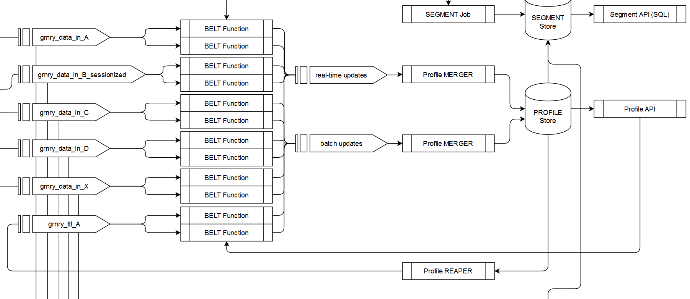

# Profile Store and Reaper



The Profile Store holds integrated data for entities in so-called profiles. Such entities can be customers, customers' contracts or customers' behavior, etc. The profile store holds a profile for each correlation id and profile type. A profile type denotes the abstract notion of an entity, such as customer, contract, or behavior.

A profile is a JSON document. A profile consists of fragments and grains. Fragments group other fragments and grains. Grains store the information at different points in time. Grain values carry the actual value and respective meta information.

## Table `profilestore`

The profile store is a distributed table in a database. Each tuple in that table represents some profile's grain at some point in time. A query to the `profilestore` table therefore retrieves a single grain value's information. The full nested JSON data structure that complies with above linked specification must be pulled via the Profile API.

`profilestore` table tuples consist of the following fields.



<table>
  <thead>
    <tr>
      <th style="text-align:left">Key</th>
      <th style="text-align:left">Description</th>
      <th style="text-align:left">Data Type</th>
      <th style="text-align:left">Default</th>
      <th style="text-align:left">Null</th>
    </tr>
  </thead>
  <tbody>
    <tr>
      <td style="text-align:left"><b>correlation_id </b>
      </td>
      <td style="text-align:left">Correlation ID. Groups all grains that belong to the same profile (cookie,
        device, customer, contact, claim, etc.). This is identical to the correlation-id
        in the Event Store.</td>
      <td style="text-align:left">varchar</td>
      <td style="text-align:left">-</td>
      <td style="text-align:left"><code>NOT NULL</code>
      </td>
    </tr>
    <tr>
      <td style="text-align:left"><b>profile_type</b>
      </td>
      <td style="text-align:left">Profile type. Describes the type of the profile.</td>
      <td style="text-align:left">varchar</td>
      <td style="text-align:left"><code>_d</code>
      </td>
      <td style="text-align:left"><code>NOT NULL</code>
      </td>
    </tr>
    <tr>
      <td style="text-align:left"><b>path</b>
      </td>
      <td style="text-align:left">Path. Denotes the grain&apos;s path in the profile&apos;s JSON data structure.
        The last past element defines the grain&apos;s name.</td>
      <td style="text-align:left">varchar</td>
      <td style="text-align:left">-</td>
      <td style="text-align:left"><code>NOT NULL</code>
      </td>
    </tr>
    <tr>
      <td style="text-align:left"><b>pit</b>
      </td>
      <td style="text-align:left">Point in Time. Captures the history of grains.</td>
      <td style="text-align:left">varchar</td>
      <td style="text-align:left"><code>_latest</code>
      </td>
      <td style="text-align:left"><code>NOT NULL</code>
      </td>
    </tr>
    <tr>
      <td style="text-align:left">value</td>
      <td style="text-align:left">Value. Stores the grain&apos;s value. Must be a JSON string or JSON array
        of strings.</td>
      <td style="text-align:left">jsonb</td>
      <td style="text-align:left">-</td>
      <td style="text-align:left"><code>NOT NULL</code>
      </td>
    </tr>
    <tr>
      <td style="text-align:left">certainty</td>
      <td style="text-align:left">Certainty. Describes the grain value&apos;s certainty.</td>
      <td style="text-align:left">real</td>
      <td style="text-align:left"><code>1.0</code>
      </td>
      <td style="text-align:left"><code>NOT NULL</code>
      </td>
    </tr>
    <tr>
      <td style="text-align:left">grain_type</td>
      <td style="text-align:left">
        <p>Grain type. Describes the grain&apos;s type. Naming convention:</p>
        <ul>
          <li>t == text</li>
          <li>a == array</li>
          <li>c == counter</li>
        </ul>
      </td>
      <td style="text-align:left">character</td>
      <td style="text-align:left">-</td>
      <td style="text-align:left"><code>NOT NULL</code>
      </td>
    </tr>
    <tr>
      <td style="text-align:left">inserted</td>
      <td style="text-align:left">Inserted. States the unix epoch timestamp in milliseconds when the grain
        was first inserted.</td>
      <td style="text-align:left">bigint</td>
      <td style="text-align:left">-</td>
      <td style="text-align:left"><code>NOT NULL</code>
      </td>
    </tr>
    <tr>
      <td style="text-align:left">ttl</td>
      <td style="text-align:left">Time to life. Allows to modify the grain after a defined duration. Format
        is <a href="https://en.wikipedia.org/wiki/ISO_8601#Durations">https://en.wikipedia.org/wiki/ISO_8601#Durations</a>.</td>
      <td
      style="text-align:left">varchar</td>
        <td style="text-align:left"><code>P100Y</code>
        </td>
        <td style="text-align:left"><code>NOT NULL</code>
        </td>
    </tr>
    <tr>
      <td style="text-align:left">reader</td>
      <td style="text-align:left">Reader. Authorizes the access to the grain. By default access is granted
        to all authenticated users.</td>
      <td style="text-align:left">varchar</td>
      <td style="text-align:left"><code>_auth</code>
      </td>
      <td style="text-align:left"><code>NOT NULL</code>
      </td>
    </tr>
    <tr>
      <td style="text-align:left">origin</td>
      <td style="text-align:left">Origin. Allows to trace the profile&apos;s origin.</td>
      <td style="text-align:left">varchar</td>
      <td style="text-align:left">-</td>
      <td style="text-align:left">-</td>
    </tr>
  </tbody>
</table>



```javascript
// retrieved via Profile API
{
  "_id": "0815",
  "a1": {
    "_latest": {
      "_v": "abc",
      "_c": 0.4,
      "_in": 123,
      "_ttl": "P100Y",
      "_origin": null,
      "_reader": "_all"
    }
  },
  "a2": {
    "b1": {
      "2018-09-21": {
        "_v": "21",
        "_c": 0.1,
        "_ttl": "P100Y",
        "_origin": null,
        "_reader": "_all"
      },
      "2018-09-22": {
        "_v": "22",
        "_c": 0.2,
        "_ttl": "P100Y",
        "_origin": null,
        "_reader": "_all"
      },
      "_latest": {
        "_v": "23",
        "_in": "2018-09-23",
        "_c": 0.3,
        "_ttl": "P100Y",
        "_origin": null,
        "_reader": "_all"
      }
    },
    "b2": {
      "_latest": {
        "_v": "123456",
        "_c": 0.4,
        "_in": "2018-09-20",
        "_ttl": "P100Y",
        "_origin": null,
        "_reader": "_all"
      }
    }
  },
  "a3": {
    "b3": {
      "c3": {
        "d3": {
          "e3": {
            "_latest": {
              "_v": "123456",
              "_c": 0.5,
              "_in": "2018-09-20",
              "_ttl": "P100Y",
              "_origin": null,
              "_reader": "_all"
            }
          }
        }
      }
    }
  }
}
```



## Component `Profile Updater`

Belts process input and create Profile Updates. The Profile Updater merges such Profile Updates into the Profile Store. These Profile Updates must follow the [Profile specification](https://github.com/syncier/grnry-kafka-profile-update/blob/master/PROFILESPECS.md). Currently there are the following operations:

#### Update Operations

| Operation Name | Input Type | Output |
| :--- | :--- | :--- |
| _\_set_ | same type as grain type | inserts the current grain value at _\_latest_ and overwrites if it already exists. |
| _\_set\_if\_not\_exist_ | same type as grain type | inserts the current grain value at _\_latest_ only if it does not already exist. |
| _\_set\_with\_history_ | same type as grain type | inserts the current grain value at _\_latest_ and stores previous _\_latest_ grain value at its insert point in time if it already exists. |
| _\_set\_with\_history\_distinct_ | same type as grain type | will do a _\_set\_with\_history_ only if the new value is distinct from the existing value. |
| _\_set\_max/\_set\_min_ | text | inserts the current grain value at  _\_latest_ and, if the value already exists, the old value at _\_latest_ will be overwritten only if the new value is higher \(resp. lower\) than the old one. Numbers will be compared numerically whereas text including dates \(ISO8601\) will be compared lexicographically. _Note: Always provide full metadata set, since global default values will be set otherwise \(not existing ones\). If the pit=latest_ _value_ _does not change, no metadata update will be done either._ |
| _\_set\_max\_with\_history/\_set\_min\_with\_history_ | text | will do a _\_set\_max_ \(resp. _\_set\_min_\) but will, in case of overwriting, additionally keep the old value at its insert point in time. |
| _\_delete_ | _text_ or _array_ | if value is _`""` or `[""]` or `[]`_, then deletes the _\_latest_ grain value at the specified path. If value is _array_ of _pit_s, then deletes grain values at the specified path and with specified _pit_s. |
| _\_inc_ | _counter_ | creates or increments a counter. |
| _\_array\_append_ | _array_ | appends to the _\_latest_ array grain value considered as a bag semantics. |
| _\_array\_append\_with\_history_ | _array_ | appends to the _\_latest_ array grain value considered as a bag semantics and stores the previous _\_latest_ grain value at pit of insertion. |
| _\_array\_put_ | _array_ | adds an element to the _\_latest_ array grain value considered as a set \(i.e., unique elements\). Executed on a non-existing grain \(i.e., it is this grain's creation\) inserts the array as is \(i.e., without de-duplication\) |
| _\_array\_put\_with\_history_ | _array_ | adds an element to the _\_latest_ array grain value considered as a set \(i.e., unique elements\) and stores the previous _\_latest_ grain value at pit of insertion. |
| _\_array\_put\_with\_history\_distinct_ | _array_ | does an _\_array\_put\_with\_history_ only if the new value is distinct from the existing value. |
|  _\_array\_remove_ | _text_ | removes all elements matching the received string from the _\_latest_ array grain value. |
| _\_array\_remove\_with\_history_ | _text_ | removes all elements matching the received string from the _\_latest_ array grain value and stores the previous _\_latest_ grain value at pit of insertion. |

Each Profile Update carries the the grain value to be merged into the store. A grain value consists of the actual value, denoted as `_v`, and its meta information. \(Currently\) `_v` must be a JSON string or a JSON array of strings.

### Counter

The _`_inc` operation's `_v`_ must be of the form: `initialvalue|stepsize|steps`, e.g., `0|1|1`. This creates or increments counter grain values like `{"_initial":0, "_step":1, "_current":1}`. Please see the above linked spec. 


_**Example:**_ The value`"10|0.5|-1"` defines a single-step decrement of width `0.5` for a counter starting at value `10`.


| Parameter | Datatype | Description |
| :--- | :--- | :--- |
| `initialvalue` | real number | defines the counter's start value. |
| `stepsize` | real number | defines the width of each counter increment/decrement |
| `steps` | real number |  the number of increments/decrements to do |

### Arrays

For arrays, Granary offers operations for the in-place modification of grain values. These operation either consider the array as a set of values with distinct entries or as bag of values where duplicates may occur. All array operations can be run with or without the creation of history.

On an array modifications, existing grain value meta data \(`_reader, _ttl, _origin, _c`\) remain unchanged. The insertion time \(`_in`\) is updated.


Be aware that all array operations have  O\(n\) characteristics \(n = size of the existing array, not just the number of elements you want to add/to set\). If you create arrays with 1000++ elements, these updates will take significantly longer than other operations, which can slow down the processing of certain partitions \(resulting in lags on these partitions when a high volume of data ist processed\).


### Profile Update Prioritization / Throtteling

Kafka Profile Updater supports a setup with a low and high priority Profile Updater. The low-prio instance is throtteled by monitoring the Kafka topic lag of the high-prio instance. To enable this setup, the [Profile Updater needs to be installed](../../../operator-reference/installation/profile-updater.md) twice with varying Kafka input topic and consumer group settings. Additionally, the low-prio Profile Updater needs to be deployed with enabled throtteling configuration.

| Parameter | Description | Default |
| :--- | :--- | :--- |
| `throttle.enabled` | Enable or disable throttling \(enable on low-prio instance\) | `false` |
| `throttle.group` | The group to monitor \(`kafka.consumerGroup` of the high-prio instance\) | `profile-update` |
| `throttle.topic` | The topic to monitor \(`kafka.inputTopic` of the high-prio instance\) | `profile-update` |
| `throttle.lagBarrier` | The maximum total lag of the high-prio instance before throttling will be applied | `100` |
| `throttle.checkIntervalMs` | Interval \(in milliseconds\) to check current lag of high-prio instance | `60000` |
| `throttle.waitTimeMs` | If `throttle.lagBarrier` is exceeded each message will be artificially throttled by this amount \(milliseconds\) | `1000` |

### Scale Profile Updater based on Kafka Topic Lag

To achieve a scaling of Kafka Updater in case of a high number of pending messages to process, a [Horizontal Pod Autoscaler](https://kubernetes.io/docs/tasks/run-application/horizontal-pod-autoscale/) can be configured. The total count of pending messages of affected Kafka topic is used as trigger to scale the deployment. The custom metrics API provider [prometheus-adapter](https://github.com/DirectXMan12/k8s-prometheus-adapter) is required to expose this metric.

Using following values file, the [prometheus-adapter helm chart](https://github.com/helm/charts/tree/master/stable/prometheus-adapter) can be installed to make the custom metric available within the custom metrics API.


```yaml
[..]
rules:
  default: false
  custom:
    - seriesQuery: '{__name__=~"^kafka_consumer_consumer_fetch_manager_metrics_records_lag$", topic="profile-batch-update"}'
      resources:
        overrides:
          kubernetes_namespace:
            resource: namespace
          kubernetes_pod_name:
            resource: pod
      name:
        matches: ""
        as: "kafka_processing_lag_profile_batch_update"
      metricsQuery: 'sum(<<.Series>>{<<.LabelMatchers>>}) by (<<.GroupBy>>)'
[..]
```


<table>
  <thead>
    <tr>
      <th style="text-align:left">value</th>
      <th style="text-align:left">description</th>
    </tr>
  </thead>
  <tbody>
    <tr>
      <td style="text-align:left">rules.default</td>
      <td style="text-align:left">disable to reduce amount of available metrics</td>
    </tr>
    <tr>
      <td style="text-align:left">rules.custom.seriesQuery</td>
      <td style="text-align:left">filter for series name which is exposed via prometheus http api request
        as __name__, additional labels for filtering can be applied</td>
    </tr>
    <tr>
      <td style="text-align:left">rules.custom.resources.overrides.kubernetes_namespace</td>
      <td style="text-align:left">
        <p>use prometheus label &quot;kubernetes_namespace&quot; as resource type
          &quot;namespace&quot; to include in the custom metrics api request.</p>
        <p></p>
        <p>Example requests looks like /apis/custom.metrics.k8s.io/v1beta1/namespaces/${kubernetes_namespace}/pods/${kubernetes_pod_name}/metricsName</p>
      </td>
    </tr>
    <tr>
      <td style="text-align:left">rules.custom.resources.overrides.kubernetes_pod_name</td>
      <td style="text-align:left">use prometheus label &quot;kubernetes_pod_name&quot; as resource type
        &quot;pod&quot; to include in the custom metrics api request</td>
    </tr>
    <tr>
      <td style="text-align:left">rules.custom.name.matches</td>
      <td style="text-align:left">filter metrics if multiple results, regex possible for rewrite</td>
    </tr>
    <tr>
      <td style="text-align:left">rules.custom.name.as</td>
      <td style="text-align:left">alias name for metric to use in kafka-profile-update helm values file</td>
    </tr>
    <tr>
      <td style="text-align:left">rules.custom.metricsQuery</td>
      <td style="text-align:left">assembled prometheus query by series name, label matcher and grouped by
        pod and namespace. Grouped values are summed up.</td>
    </tr>
  </tbody>
</table>

For every instance of kafka-profile-update that should be scaled a custom metrics series is required. To achieve this, configure the prometheus-adapter ruleset by duplicating the whole seriesQuery block and adjust topic \(rules.custom.seriesQuery\) and metric name \(rules.custom.name.as\).

To verify the prometheus-adapter is working with the defined ruleset, query the custom metrics endpoint. The kubernetes URL may vary depending on cluster setup. Metrics of empty prometheus response will result in an empty ressources array.

```text
$ kubectl get --raw /apis/custom.metrics.k8s.io/v1beta1/ | jq
{
  "kind": "APIResourceList",
  "apiVersion": "v1",
  "groupVersion": "custom.metrics.k8s.io/v1beta1",
  "resources": [
    {
      "name": "namespaces/kafka_processing_lag_profile_batch_update",
      "singularName": "",
      "namespaced": false,
      "kind": "MetricValueList",
      "verbs": [
        "get"
      ]
    },
    {
      "name": "pods/kafka_processing_lag_profile_batch_update",
      "singularName": "",
      "namespaced": true,
      "kind": "MetricValueList",
      "verbs": [
        "get"
      ]
    }
  ]
}
```

Verify HPA condition `AbleToScale`  and `ScalingActive` to be set `True`:

```text
$ kubectl describe hpa/grnry-kafka-profile-batch-update                                                                            ✔  6418  15:21:22 
Name:                                  grnry-kafka-profile-batch-update
Namespace:                             test
Labels:                                <none>
Annotations:                           <none>
CreationTimestamp:                     Wed, 02 Oct 2019 11:06:47 +0200
Reference:                             Deployment/grnry-kafka-profile-batch-update
Metrics:                               ( current / target )
  "kafka_processing_lag_profile_batch_update" on pods:  0 / 1k
Min replicas:                          1
Max replicas:                          4
Deployment pods:                       1 current / 1 desired
Conditions:
  Type            Status  Reason            Message
  ----            ------  ------            -------
  AbleToScale     True    ReadyForNewScale  recommended size matches current size
  ScalingActive   True    ValidMetricFound  the HPA was able to successfully calculate a replica count from pods metric kafka_processing_lag_profile_batch_update
  ScalingLimited  True    TooFewReplicas    the desired replica count is more than the maximum replica count
```

Although `AbleToScale`  and `ScalingActive` are set `True`, it will take 5 minutes by default to trigger on conditions after initial deploy of the HPA definition. Scaling on processing lag is now working and will scale the deployment as soon as the offset of 1000 messages in processing is reached.

### Dead Letter Queue \(DLQ\)

In GRNRY, we have created so called _dead letter queues_. The Profile Updater's dead letter queue is used to receive all the data that could not be processed correctly.

By default the Profile Updater's dead letter queue is called: 

```yaml
profile-update-dead-letter
```

In order to rename it one must change the helm deployment parameter:

```yaml
kafka.deadLetterTopic: "profile-update-dead-letter"
```

#### When is Something Written to the Dead Letter Queue?

Profile Updater writes profile update messages to dead letter queue in case:

* the grain type of the provided value does not match the provided operation, e.g. if:
  * operation is `_inc`but grain value \(`_v`\) is not a valid counter
  * operation is one of `array_append`, `_array_append_with_history`, `_array_put`, `_array_put_with_history` but grain value \(`_v`\) is not an array
  * operation is one of `_array_remove`, `_array_remove_with_history`, `_set_min`, `_set_max`, `_set_min_with_history`, `_set_max_with_history` but grain value \(`_v`\) is not a string
  * operation is`_delete`  but grain value \(`_v`\) is not the empty string \(`""`\) or an array of pits
* correlationId \(\_id\) is an empty string \(""\)
* certainty \(`_c`\) is not between 0 and 1
* creation timestamp \(`_in`\) is negative
* time to live \(`_ttl`\) does not comply ISO 860 time period
* time to live \(`_ttl`\) contains a negative number
* an update is made and the grain type in the profile update contains a grain type that differs from existing grain type in Profile Store

All failed updates sent to the DLQ will be annotated with two additional headers:

<table>
  <thead>
    <tr>
      <th style="text-align:left">Header</th>
      <th style="text-align:left">Description</th>
    </tr>
  </thead>
  <tbody>
    <tr>
      <td style="text-align:left">grnry-exception-message</td>
      <td style="text-align:left">
        <p>A descriptive text why that operation was sent to the DLQ.
          <br />Examples:</p>
        <p><code>&quot;Value must be an Array&quot; or &quot;_v can not be null&quot;</code>
        </p>
      </td>
    </tr>
    <tr>
      <td style="text-align:left">grnry-exception-stacktrace</td>
      <td style="text-align:left">Full stack trace of the exception for further analysis</td>
    </tr>
  </tbody>
</table>

### Handling of Unexpected Exceptions

The previous paragraph described the extensive checks that will be applied either before all or after **failed** executions. If any of the checks fails, the update message will simply be sent to the DLQ. But besides these known \(hence expected\) exceptions, other failures might occur \(e.g. database is unavailable, corrupt tables or implementation errors\). By default, the Profile-Updater will retry operations that are failing due to an unexpected exception over and over again with exponential back-off. Accordingly, if the database is temporarily unavailable, the operation should succeed as soon as it is available again. But if the failure is of permanent nature \(like an implementation error\), the profile updater would try to execute the operation indefinitely, blocking the processing of this partition.

The retry behavior can be configured in a way that the Profile Updater will handle failed update messages by sending them to the dead letter queue straight away \(annotated with an exception message and the stacktrace\), instead of entering an infinite retry loop. \(See helm chart documentation.\)

### Handling of Very Long Running Executions

The execution of some operations can take significantly longer if they operate on very big grain values \(e.g. arrays\). You can configure the profile updater to log warnings on long running operations \(default: 1000 ms\) and there are also execution times metrics \(per operation\) available in Prometheus/Grafana to monitor the overall performance/throughput.

As long as the execution time stays below the value set in your  `max.poll.interval.ms` Kafka consumer configuration \(`300000 ms` by default\), operations might take longer, but will eventually succeed. If, on the other hand, the execution time exceeds this value, the operation can no longer be executed successfully and it will result in an endless retry loop, regardless of the selected mode for unexpected exceptions \(re-try vs. sent to DLQ\). In that case you would have to increase your  `max.poll.interval.ms` value.

