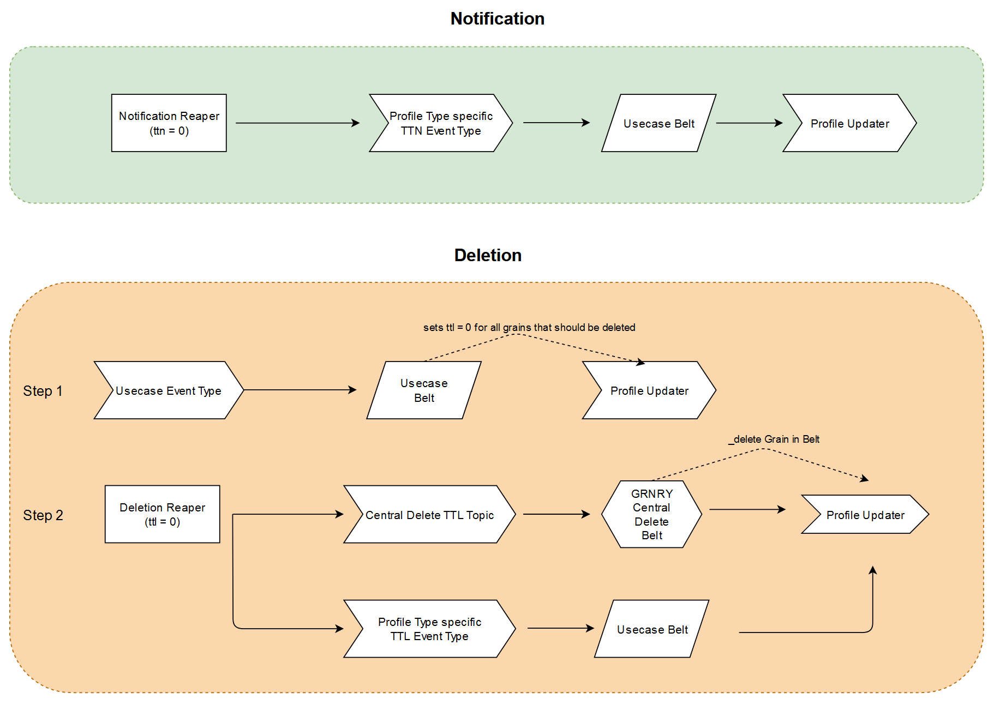

# Reaper

The Granary Reaper is responsible for collecting expired grains by querying them from the [Profile Store](./) according to a CRON schedule and writing them back into the data pipeline through a TTN/TTL Kafka topic. 

The Reaper requires a special index on Profile Store to run. Please consult the [Reaper installation](../../../operator-reference/installation/with-helm/reaper.md) documentation.

## Configuration

| Parameter Name | Description | Default value |
| :--- | :--- | :--- |
| IO\_GRNRY\_REAPER\_BACKWARDS\_COMPATIBLE | Flag indicating if Reaper runs on 0.7 feature-level, for 0.8+ should be set to `false` | true |
| IO\_GRNRY\_REAPER\_HARVESTER\_API\_URL | Harvester API URL | https://localhost:8080 |
| IO\_GRNRY\_REAPER\_AUTHENTICATION\_URL | Keycloak URL | https://localhost:8080 |
| IO\_GRNRY\_REAPER\_CONNECTION\_RETRIES | Number of retries to make on failing HTTP requests | 5 |
| IO\_GRNRY\_REAPER\_KEYCLOAK\_REALM | Keycloak Realm | grnry |
| IO\_GRNRY\_REAPER\_KEYCLOAK\_CLIENT\_ID | Keycloak Client ID | harvester-api |
| IO\_GRNRY\_REAPER\_GRAIN\_FETCH\_SIZE | Job batch size of grains to read | 100 |
| IO\_GRNRY\_REAPER\_REAPER\_TYPE | Specifies the reaper type .  `ttl` \(deletion\) or `ttn` \(notification\) | `ttl` |
| IO\_GRNRY\_REAPER\_EVENT\_TYPE\_RETENTION\_MS | Kafka retention for TTN/TTL Event Types created by the Reaper | 300000 |
| IO\_GRNRY\_REAPER\_EVENT\_TYPE\_PARTITIONCOUNT | Kafka partition count for TTN/TTL Event Types created by the Reaper | 24 |
| IO\_GRNRY\_REAPER\_EVENT\_TYPE\_REPLICATION | Kafka replication for TTN/TTL Event Types created by the Reaper | 2 |
| IO\_GRNRY\_REAPER\_EVENT\_TYPE\_TTL | ISO8601 TTL for TTL Event Types created by the Reaper | P100Y |
| IO\_GRNRY\_REAPER\_DATASOURCE\_TABLE\_NAME | Table name of Profile Store | profilestore |
| IO\_GRNRY\_REAPER\_INCLUDED\_PROFILE\_TYPES | A comma-separated list of Profile types to include in the result set |  |
| IO\_GRNRY\_REAPER\_INCLUDED\_PROFILE\_PATHS | A comma-separated list of paths to include in the result set |  |
| IO\_GRNRY\_REAPER\_INNER\_JOIN\_TABLE | Name of a table that will be joined on path with the result set to allow arbitrary selection. If this option is used the INCLUDED\_PROFILE\_TYPES and INCLUDED\_PROFILE\_PATHS options are inactive. Please note that when using this option the columns in the where clause have to be prefixed with a. \(for Profilestore\) or b. \(for the inner-join table\) |  |
| PROFILESTORE\_HOSTNAME | Hostname of Profile Store | grnry-pg |
| PROFILESTORE\_PORT | Port of Profile Store | 5432 |
| PROFILESTORE\_DB\_NAME | Database name of Profile Store | postgres |

## Output

Please note that to comply with the data protection law, TTN/TTL grains will not carry a value. 

### Kafka Message Header Fields

Description of the header fields can be found in the [Belt Extractor](../belt-extractor.md#callback-signature) specification.

| Field Name | Value |
| :--- | :--- |
| topic | `{fetched from Harvester API event type endpoints}` |
| kafka\_messageKey | `{profile type}` |
| grnry-harvester-name | `"grnry-reaper"` |
| grnry-correlation-id | `{correlation id}` |
| grnry-event-timestamp | `{reaper processing time timestamp}` |
| grnry-event-id | `{reaper generated event UUID}` |
| grnry-event-type | `{normalized profile type}` |

### Kafka Message Payload Fields

| Field name | Description |
| :--- | :--- |
| correlationId | The grain's correlation ID |
| profileType | The grain's profile type |
| path | The grain's path |
| pit | The grain's pit |
| grain\_type | The grain's type |
| inserted | The grain's profile store insertion timestamp  |
| ttl | The grain's ttl \(ISO8601\) |
| ttn | The grain's ttn \(ISO8601\) |
| reader | The grain's reader |
| origin | The grain's origin |

