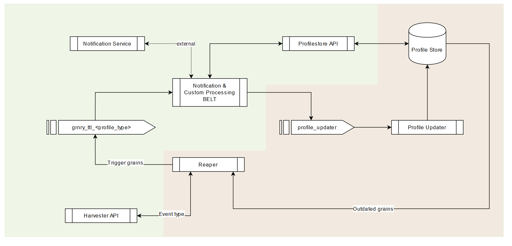

# Reaper

The Granary Reaper is responsible for collecting expired grains by querying them from the [Profile Store](./) according to a CRON schedule and writing them back into the data pipeline through a TTN/TTL Kafka topic. 

The Reaper requires a special index on Profile Store to run. Please consult the [Reaper installation](../../../operator-reference/installation/with-helm/reaper.md) documentation.

## Configuration


Event Type names must be different from Profile Type names so that the Reaper can work correctly.


<table>
  <thead>
    <tr>
      <th style="text-align:left">Parameter Name</th>
      <th style="text-align:left">Description</th>
      <th style="text-align:left">Default value</th>
    </tr>
  </thead>
  <tbody>
    <tr>
      <td style="text-align:left">IO_GRNRY_REAPER_BACKWARDS_COMPATIBLE</td>
      <td style="text-align:left">Flag indicating if Reaper runs on 0.7 feature-level, for 0.8+ should be
        set to <code>false</code>
      </td>
      <td style="text-align:left">true</td>
    </tr>
    <tr>
      <td style="text-align:left">IO_GRNRY_REAPER_HARVESTER_API_URL</td>
      <td style="text-align:left">Harvester API URL</td>
      <td style="text-align:left">https://localhost:8080</td>
    </tr>
    <tr>
      <td style="text-align:left">IO_GRNRY_REAPER_AUTHENTICATION_URL</td>
      <td style="text-align:left">Keycloak URL</td>
      <td style="text-align:left">https://localhost:8080</td>
    </tr>
    <tr>
      <td style="text-align:left">IO_GRNRY_REAPER_CONNECTION_RETRIES</td>
      <td style="text-align:left">Number of retries to make on failing HTTP requests</td>
      <td style="text-align:left">5</td>
    </tr>
    <tr>
      <td style="text-align:left">IO_GRNRY_REAPER_KEYCLOAK_REALM</td>
      <td style="text-align:left">Keycloak Realm</td>
      <td style="text-align:left">grnry</td>
    </tr>
    <tr>
      <td style="text-align:left">IO_GRNRY_REAPER_KEYCLOAK_CLIENT_ID</td>
      <td style="text-align:left">Keycloak Client ID</td>
      <td style="text-align:left">harvester-api</td>
    </tr>
    <tr>
      <td style="text-align:left">IO_GRNRY_REAPER_GRAIN_FETCH_SIZE</td>
      <td style="text-align:left">Job batch size of grains to read</td>
      <td style="text-align:left">100</td>
    </tr>
    <tr>
      <td style="text-align:left">IO_GRNRY_REAPER_EVENT_TYPE_RETENTION_MS</td>
      <td style="text-align:left">Kafka retention for TTN/TTL Event Types created by the Reaper</td>
      <td
      style="text-align:left">300000</td>
    </tr>
    <tr>
      <td style="text-align:left">IO_GRNRY_REAPER_EVENT_TYPE_PARTITIONCOUNT</td>
      <td style="text-align:left">Kafka partition count for TTN/TTL Event Types created by the Reaper</td>
      <td
      style="text-align:left">24</td>
    </tr>
    <tr>
      <td style="text-align:left">IO_GRNRY_REAPER_EVENT_TYPE_REPLICATION</td>
      <td style="text-align:left">Kafka replication for TTN/TTL Event Types created by the Reaper</td>
      <td
      style="text-align:left">2</td>
    </tr>
    <tr>
      <td style="text-align:left">
        
IO_GRNRY_REAPER_EVENT_TYPE_TTN/

        
IO_GRNRY_REAPER_EVENT_TYPE_TTL

      </td>
      <td style="text-align:left">ISO8601 TTN/TTL for TTN/TTL Event Types created by the Reaper</td>
      <td
      style="text-align:left">P100Y</td>
    </tr>
    <tr>
      <td style="text-align:left">IO_GRNRY_REAPER_DATASOURCE_TABLE_NAME</td>
      <td style="text-align:left">Table name of Profile Store</td>
      <td style="text-align:left">profilestore</td>
    </tr>
    <tr>
      <td style="text-align:left">IO_GRNRY_REAPER_INCLUDED_PROFILE_TYPES</td>
      <td style="text-align:left">A comma-separated list of Profile types to include in the result set</td>
      <td
      style="text-align:left"></td>
    </tr>
    <tr>
      <td style="text-align:left">IO_GRNRY_REAPER_INCLUDED_PROFILE_PATHS</td>
      <td style="text-align:left">A comma-separated list of paths to include in the result set</td>
      <td style="text-align:left"></td>
    </tr>
    <tr>
      <td style="text-align:left">IO_GRNRY_REAPER_INNER_JOIN_TABLE</td>
      <td style="text-align:left">Name of a table that will be joined on path with the result set to allow
        arbitrary selection. If this option is used the INCLUDED_PROFILE_TYPES
        and INCLUDED_PROFILE_PATHS options are inactive. Please note that when
        using this option the columns in the where clause have to be prefixed with
        a. (for Profilestore) or b. (for the inner-join table)</td>
      <td style="text-align:left"></td>
    </tr>
    <tr>
      <td style="text-align:left">PROFILESTORE_HOSTNAME</td>
      <td style="text-align:left">Hostname of Profile Store</td>
      <td style="text-align:left">grnry-pg</td>
    </tr>
    <tr>
      <td style="text-align:left">PROFILESTORE_PORT</td>
      <td style="text-align:left">Port of Profile Store</td>
      <td style="text-align:left">5432</td>
    </tr>
    <tr>
      <td style="text-align:left">PROFILESTORE_DB_NAME</td>
      <td style="text-align:left">Database name of Profile Store</td>
      <td style="text-align:left">postgres</td>
    </tr>
  </tbody>
</table>

## Output

Please note that to comply with the data protection law, TTN/TTL grains will not carry a value. 

### Kafka Message Header Fields

Description of the header fields can be found in the [Belt Extractor](../belt-extractor.md#callback-signature) specification.

| Field Name | Value |
| :--- | :--- |
| topic | `{fetched from Harvester API event type endpoints}` |
| kafka\_messageKey | `{profile type}` |
| grnry-harvester-name | `"grnry-reaper"` |
| grnry-correlation-id | `{correlation id}` |
| grnry-event-timestamp | `{reaper processing time timestamp}` |
| grnry-event-id | `{reaper generated event UUID}` |
| grnry-event-type | `{normalized profile type}` |

### Kafka Message Payload Fields

| Field name | Description |
| :--- | :--- |
| correlationId | The grain's correlation ID |
| profileType | The grain's profile type |
| path | The grain's path |
| pit | The grain's pit |
| grain\_type | The grain's type |
| inserted | The grain's profile store insertion timestamp  |
| ttl | The grain's ttl \(ISO8601\) |
| ttn | The grain's ttn \(ISO8601\) |
| reader | The grain's reader |
| origin | The grain's origin |

