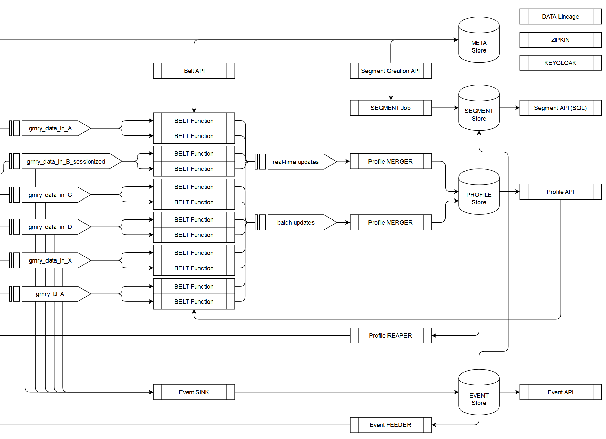

# Segment Store

The Segment Store holds information derived from the Event Store or the Profile Store. Such a derivative can be a selection of events or profiles. It may also comprise a projection of Event or Profile fields. Conceptually, a segment can be understood as a materialized view, which is updated periodically.

The Segment Store is a table or a view in a database. Each tuple in that table represents an event or a profile, comprising selected and projected fields. Note that for profiles, the segments are relational representations of the nested Profile JSON data structure. For events, the segments merely comprise selections and projections.

The subpages describe segment definition and deployment.