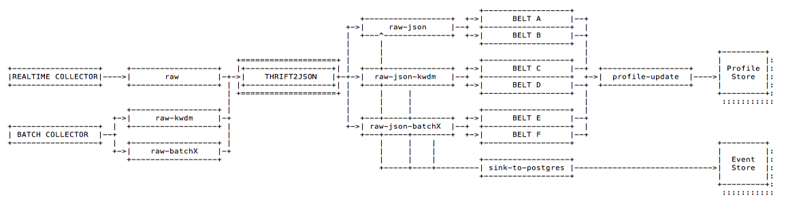

# Metadata Extractor




A Python App that extracts a Correlation ID and a Timestamp to be used for creation and update of profiles as well as keys for queries against the eventstore.

## Input Topic `'raw'`



| Metadata Fields | Description |
| :--- | :--- |
| key | uuid created by Snowplow Kafka Producer |
| value | Payload written by Snowplow |
| $$-$$ schema | Snowplow Event Schema Reference |
| $$-$$ ipAddress | ipAddress if Snowplow is configured to collect this |
| $$-$$ timestamp  | time of event creation or reception\(?\) |
| $$-$$ collector  | identifies the source platform of the event |
| $$-$$ body  | Snowplow Event Data \(depending on `schema`\) |
| $$-$$ headers  | HTTP headers |
| $$-$$ ...  | ... |







## Configuration



A yaml file is expected that contains a set of labeled regular expressions which are all applied to the `value.body` attribute of the input message. For matching rules the specified part is extracted and passed into the outgoing message using the rule-label as the name of the forwarded attribute.





```yaml
web:
  snowplow:
    - id: ".*?"
  facebook:
    - url: "https://facebook.com/(.*?)/"
  userid:
    - uid: ".*?"
  allianz:
    - vertragspartner: ".*?"
    - riskhash: ".*?"
mobile:
  appid:
    - aid: ".*?"
  imei:
    - deviceid: ".*"
  linkid:
    - se_va: '[-+]?[0-9]*\.?[0-9]*'
```





## Output Topic `'raw-json'`



<table>
  <thead>
    <tr>
      <th style="text-align:left">Payload Fields</th>
      <th style="text-align:left">Description</th>
    </tr>
  </thead>
  <tbody>
    <tr>
      <td style="text-align:left">metadata</td>
      <td style="text-align:left">Kafka specific fields</td>
    </tr>
    <tr>
      <td style="text-align:left">payload</td>
      <td style="text-align:left">Forwarded from input attribute <code>value </code>
      </td>
    </tr>
    <tr>
      <td style="text-align:left"><em></em> schema</td>
      <td style="text-align:left">Snowplow Event Schema Reference</td>
    </tr>
    <tr>
      <td style="text-align:left"><em></em> ipAddress</td>
      <td style="text-align:left">ipAddress if Snowplow is configured to collect this</td>
    </tr>
    <tr>
      <td style="text-align:left"><em></em> timestamp</td>
      <td style="text-align:left">time of event creation or reception(?)</td>
    </tr>
    <tr>
      <td style="text-align:left"><em></em> collector</td>
      <td style="text-align:left">identifies the source platform of the event</td>
    </tr>
    <tr>
      <td style="text-align:left"><em></em> body</td>
      <td style="text-align:left">Snowplow Event Data (depending on <code>schema</code>)</td>
    </tr>
    <tr>
      <td style="text-align:left"><em></em> headers</td>
      <td style="text-align:left">HTTP headers</td>
    </tr>
    <tr>
      <td style="text-align:left">payloadid</td>
      <td style="text-align:left"></td>
    </tr>
    <tr>
      <td style="text-align:left">correlationid</td>
      <td style="text-align:left">
        <p>extracted from <code>payload.body</code> 
        </p>
        <p>Used to group events received from the same tracking entity.</p>
      </td>
    </tr>
    <tr>
      <td style="text-align:left">eventid</td>
      <td style="text-align:left">used to deduplicate events</td>
    </tr>
    <tr>
      <td style="text-align:left">created</td>
      <td style="text-align:left">used to recreate the original order of events</td>
    </tr>
  </tbody>
</table>



```javascript
{
	"metadata": "{\"headers\": null, \"topic\": \"raw\", \"partition\": 0, \"key\": \"9417415d-7359-4ad0-8c3b-46ff4ca78c44\", \"timestamp\": [1, 1540748298485], \"offset\": 1746229}",
	"payload": {
		"body": "{ ... }",
		"collector": "ssc-0.13.0-kafka",
		"encoding": "UTF-8",
		"headers": ["Host: aws-eu1.grnry.io", "Accept: text/html, application/xhtml+xml, application/xml;q=0.9, image/webp, image/apng, */*;q=0.8", "Accept-Encoding: gzip, deflate, br", "Accept-Language: de-DE, de;q=0.9, en-US;q=0.8, en;q=0.7", "Cookie: _ga=GA1.2.1323636424.1533625971; ajs_anonymous_id=%22058bbd8d-cb74-47e4-aa27-9cc5fa4546aa%22; ajs_group_id=null; ajs_user_id=%22QjAVZpXa7qgJdZs6vGsNMA5M9yH3%22; mp_96b84420a1a32e448f73e7b9ffccebdb_mixpanel=%7B%22distinct_id%22%3A%20%22165133b330da0-0ad91354656274-47e1039-1fa400-165133b330f15e%22%2C%22%24initial_referrer%22%3A%20%22%24direct%22%2C%22%24initial_referring_domain%22%3A%20%22%24direct%22%7D", "Upgrade-Insecure-Requests: 1", "User-Agent: Mozilla/5.0 (Windows NT 10.0; Win64; x64) AppleWebKit/537.36 (KHTML, like Gecko) Chrome/67.0.3396.99 Safari/537.36", "X-Forwarded-For: 82.207.192.113", "X-Forwarded-Port: 443", "X-Forwarded-Proto: https", "Connection: keep-alive", "Timeout-Access: <function1>"],
		"hostname": "aws-eu1.grnry.io",
		"ipAddress": "82.207.192.113",
		"networkUserId": "631b9979-16b8-44ed-87b1-86b7d92d8223",
		"path": "/i",
		"schema": "iglu:com.snowplowanalytics.snowplow/CollectorPayload/thrift/1-0-0",
		"timestamp": 1535972952029,
		"userAgent": "Mozilla/5.0 (Windows NT 10.0; Win64; x64) AppleWebKit/537.36 (KHTML, like Gecko) Chrome/67.0.3396.99 Safari/537.36"
	},
    {
      "payloadid" : {
         "correlationid": "cookie_dW5kIG5pZW1hbHMgdmVyZ2Vzc2VuIGVpc2VybiB1bmlvbg==",
         "eventid": "819f785b-82f7-4994-bbd8-992c94bdf7bc",
         "created": 1541345852941,
      }
    }
}
```




