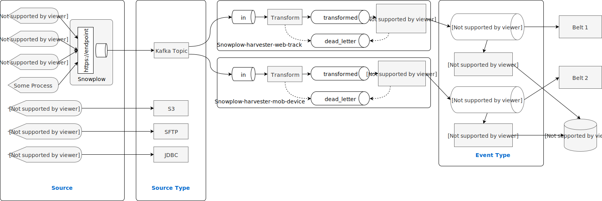

# Get Data Into Granary

In this chapter we are going to learn, how to get data into the plattform. Before we start, we are going to have a look at the different components and the data-in pipeline.

## Overview

Data-In starts with your source. Your source can be any data you wish to extract from or write into the grnry plattform. This source is the starting point for the development. The source can be anything from web trackers to database tables or S3 buckets. These sources can be consumed by a so-called Source Type. These are source-specific implementations exposing configuration options to connect to the actual source. Already available source type implementations in Granary contain, among others, AWS S3, Kafka Topics, SFTP Servers or JDBC source. 


Harvesters for _S3_, _SFTP_, and _JDBC_ Source Types follow the same schema as _Kafka Topic_ Source Type.


<table>
  <thead>
    <tr>
      <th style="text-align:left">Name</th>
      <th style="text-align:left">Description</th>
    </tr>
  </thead>
  <tbody>
    <tr>
      <td style="text-align:left">Event Type</td>
      <td style="text-align:left">A named data entity type. Determines schema and metadata extraction rules.
        Each event type is backed by a kafka topic.</td>
    </tr>
    <tr>
      <td style="text-align:left">Harvester</td>
      <td style="text-align:left">
        
Set of components and configuration.

        
Harvester has states is &quot;defined&quot;, &quot;started&quot;, &quot;paused&quot;
          or &quot;stopped&quot;. It will read from a source and will produce events
          for a given event type.

      </td>
    </tr>
    <tr>
      <td style="text-align:left">Source</td>
      <td style="text-align:left">Physical source of the data. Also might lie outside of Granary network.</td>
    </tr>
    <tr>
      <td style="text-align:left">Source Type</td>
      <td style="text-align:left">Accepts and imports data from the source.</td>
    </tr>
    <tr>
      <td style="text-align:left">Transform Processor</td>
      <td style="text-align:left">Converts source specific input to json</td>
    </tr>
    <tr>
      <td style="text-align:left">Metadata Extractor Processor</td>
      <td style="text-align:left">Checks schema and derives meta data from json</td>
    </tr>
    <tr>
      <td style="text-align:left">Eventstore Sink</td>
      <td style="text-align:left">Stores single event type in Event Store</td>
    </tr>
    <tr>
      <td style="text-align:left">Harvester Version</td>
      <td style="text-align:left">Changes whenever component or configuration changes. K8s labels for havester
        and version.</td>
    </tr>
  </tbody>
</table>

The source type is the abstraction from the real source and can be configured. It handles all the data we retrieve from the source. The`source type` writes the data into a Kafka channel. From there, we have a `transform` step. In this transform step you should convert your data into JSON format. In addition, you may create any additional transformation steps you may like, such as creating session IDs or deleting empty fields. As a result the transform step writes into another Kafka topic. From the this topic the data is read by the metadata extractor. This metadata extractor extracts information such as the correlation\_id, which is the unique identifier for data. As a result we write into another topic named after the event type. This topic can then be consumed by belts, which we are going to talk about later. The data-in channel ends here. However, there is one additional component, you can deploy, the eventstore sink. The eventstore sink consumes the same Kafka Topic and writes this data into the event store.

The whole path described here: `source type --> transform --> metadata extractor` is referred to as harvester. The harvester defines the data-in channel for a specific event type.

## Realization of data-in in GRNRY

Granary exposes the [Harvester API](../../developer-reference/api-reference/harvester-api.md) to create and manage Harvesters. The Harvester API is backed by Spring Cloud Data Flow \(SCDF - [https://dataflow.spring.io/](https://dataflow.spring.io/)\) - a platform to build cloud native data pipelines for streaming and batch purposes. Built on top of the Spring Framework, each different processing step is a spring cloud stream application \([https://spring.io/projects/spring-cloud-stream](https://spring.io/projects/spring-cloud-stream)\). Granary ships some additional features for SCDF, supporting special source types or native encryption of data going through the pipeline.

