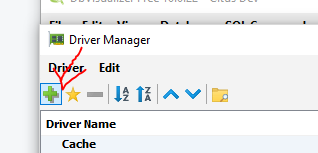
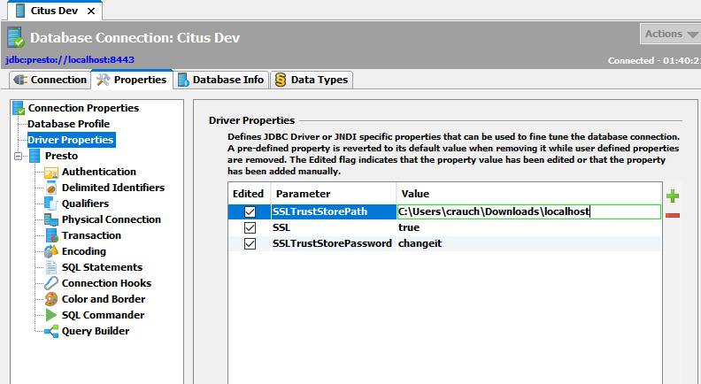
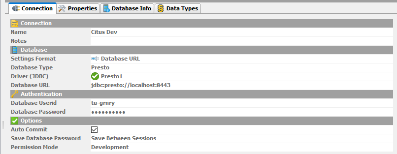
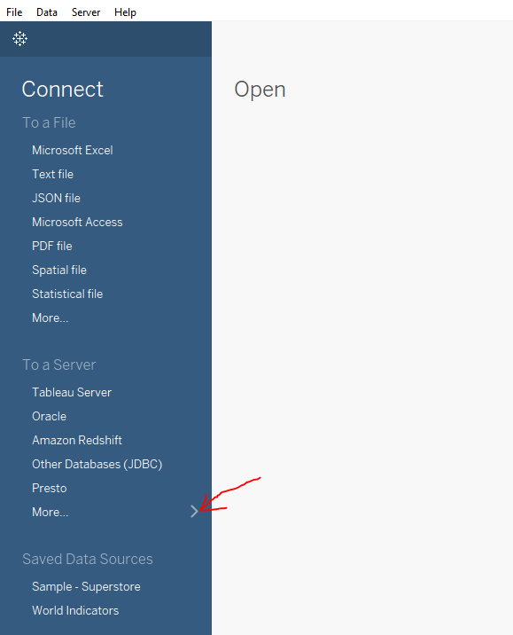
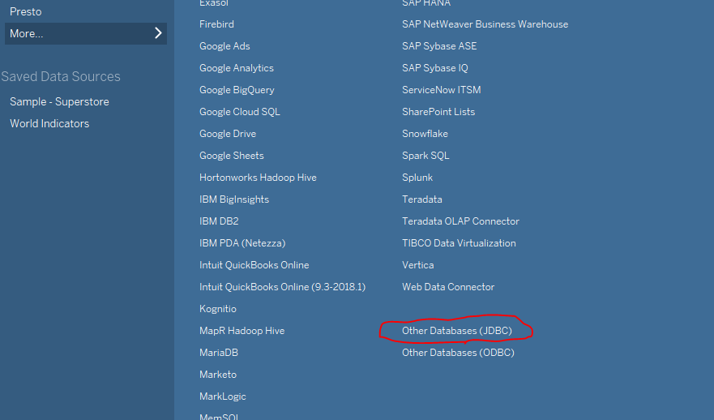
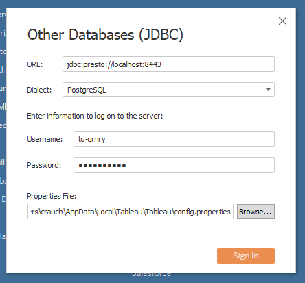

# How to access a Segment

### Configure DBVisualizer to use Segment Store API

1. Download [DBVisualizer](https://www.dbvis.com/download).
2. Open DBVisualizer.
3. Go to "Database" -&gt; "Create Database Connection". 

    

4. Configure the database connection using the "Presto" database driver. If it is not listed, you can download it from [https://prestodb.github.io/docs/current/installation/jdbc.html](https://prestodb.github.io/docs/current/installation/jdbc.html) and add it by following the instructions on [http://confluence.dbvis.com/display/UG100/Installing+a+JDBC+Driver](http://confluence.dbvis.com/display/UG100/Installing+a+JDBC+Driver).
   1. 
   2.  
   3.  
   4. For the URL, ask your friendly Granary Ops Engineer.
5. Under "Properties" -&gt; "Driver Properties" provide SSL-related properties.

   1. SSL = true
   2. SSLTrustStorePath = &lt;your/truststore-path&gt;
   3. SSLTrustStorePassword = changeit

   

6. Ask your friendly Granary Ops Engineer to add the following _roles needed to explore the database_ via DBVisualizer in Granary's Keycloak.
   1. Go to "clients" -&gt; "jdbc api" -&gt; "roles" -&gt; "add roles".
   2. Add the following roles:
      1. postgresql.information\_schema.tables
      2. postgresql.information\_schema.columns
      3. postgresql.information\_schema.schemata
      4. system.jdbc.table\_types
      5. system.jdbc.types
      6. system.jdbc.catalogs
      7. system.jdbc.tables
      8. system.jdbc.schemas
   3. In Keycloak assign new roles to your user.
      1. Go to "users" -&gt; "&lt;your user&gt;" -&gt; "role mapping" -&gt; "client roles" -&gt; "jdbc api"
      2. Assign available roles
7. Further ask your Granary Ops Engineer to add the following _roles to access your segement_ of choice via DBVisualizer in Granary's Keycloak.
   1. Again go to "clients" -&gt; "jdbc api" -&gt; "roles" -&gt; "add roles".
   2. Add the following role\(s\):
      1. postgresql.segments.&lt;segment name&gt;
   3. In Keycloak assign new roles to your user.
      1. Again go to "users" -&gt; "&lt;your user&gt;" -&gt; "role mapping" -&gt; "client roles" -&gt; "jdbc api"
      2. Assign available segement roles
8. In DBVisualizer enter Granary username and password

   

9. Click "Connect".  

### Configure Tableau to use Segment Store API

1. Open Tableau.
2. Go to "Connect" -&gt; "To a Server" -&gt; "More"

      

3. Go to "Other Databases \(JDBC\)".

     

4. Get Presto driver from [https://prestodb.github.io/docs/current/installation/jdbc.html](https://prestodb.github.io/docs/current/installation/jdbc.html).
5. Save driver to C:\Program Files\Tableau\Drivers \(Windows\).
6. Enter server details. For the URL, ask your friendly Granary Ops Engineer.
7. Provide config.properties file. E.g.,

   
   ```text
   SSL=true 
   SSLKeyStorePath=<path to trustore>
   SSLKeyStorePassword=changeit
   ```
   

8. Enter Granary username and password.
9. In Keycloak make sure your user has the needed roles \(see point 5. [above](segment-store-api.md#set-up-jdbc-api-config-using-dbvisualizer)\).
10. Click "Sign In".


    


