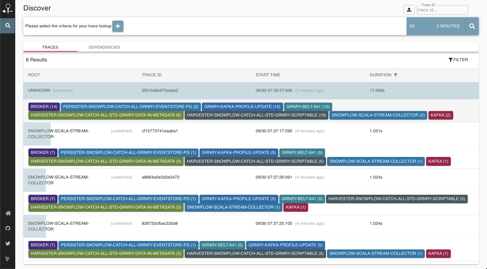
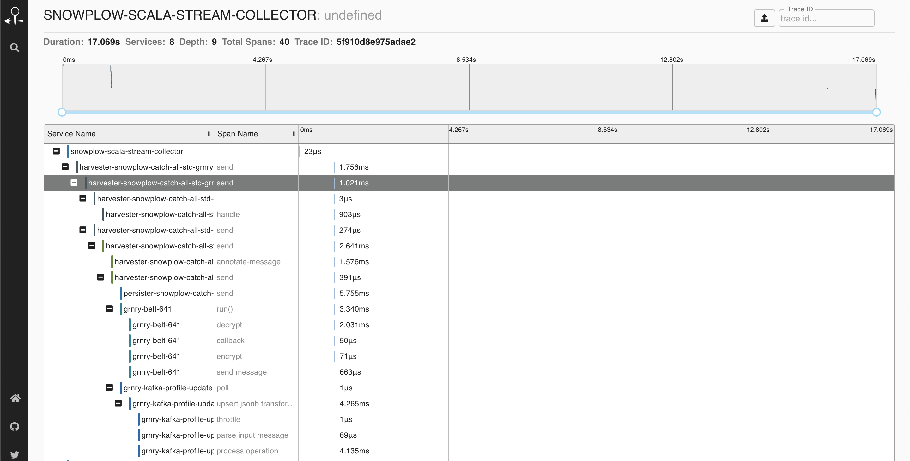
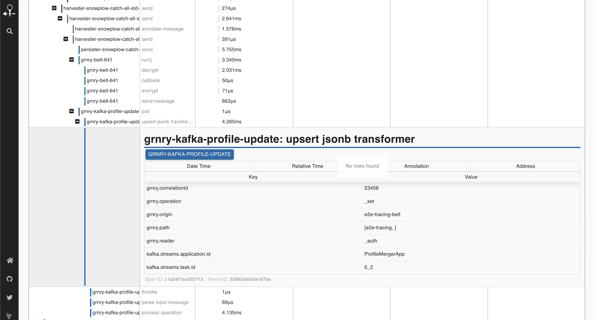

# Tracing Granary

## Introduction

To gather timing data needed to troubleshoot latency problems in Granary data pipeline, we integrated OpenZipkin, an open-sourced distributed tracing system, into Granary components. When tracing is enabled, Granary users will be able to keep track on the timing of sampled events using Granary Zipkin UI.

## Enabling/disabling tracing

By default, **self-tracing is** **enabled** throughout Granary pipeline with a sample rate of 0.1. The sample rate in Zipkin indicates the sampling rate of a signal. For example, a sample rate of 0.1 indicates that 10 events of 100 will be sampled and send their timing data to Zipkin. A sample rate should be a value between 0.0 and 1.0. 

The following describes how Granary users can disable (enable) tracing in each of the Granary components.

### Harvesters

Set the following optional parameter to disable tracing:

```
"spring.sleuth.enabled": false
```

To configure the sample rate to 50%, for example, set

```
spring.sleuth.sampler.probability=0.5
```

### Belt API

To disable self-tracing and also tracing in the belts deployed through Belt API, please configure the parameter:

```
BELT_TRACING=false
```

The sample rate configuration is 

```
BELT_TRACING_PROBABILITY=0.1 
```

If you are deploying by Helm, set the following in your values.yaml:

```
tracing:
  disabled: false
  probability: 0.01 # to be set when tracing is enabled
```

### Belt Extractor

For belts deployed directly without Belt API, the way to disable tracing is to set

```
TRACING_DISABLED=true
```

The sample rate is defined by

```
TRACING_SAMPLE_RATE=0.1
```

In Helm values.yaml, the relevant configuration parameters would be

```
  tracing:
    disabled: false
    sampleRate: 0.1
```

### Profilestore API, Eventstore API

Similar to Belt API, set the following to disable/enable tracing and set the sample rate:

```
<API_NAME>_TRACING=false
<API_NAME>_PROBABILITY=0.1
```

For example for Eventstore API:

```
EVENTSTORE_TRACING=false
EVENTSTORE_PROBABILITY=0.1
```

### Snowplow

To disable tracing in Snowplow, configure this in the values.yaml:

```
tracingDisabled: true
```


```
Note: This will also set `X-B3-Sampled: 0` to the intercepted record headers. Downstream components consuming this record are affected by this.*
```


To adjust in which rate the traces are sampled, set:

```
samplerate: 0.01
```

## How to make data traceable

Assuming tracing is enabled in all Granary components, the Snowplow API will set a Trace ID internally for every (or as configured in `samplerate`) HTTP request sent to the API. Should there be a need to set a custom Trace ID, Granary users should include

```
X-B3-TraceId=<CUSTOM_64_OR_128_BIT_ID>
X-B3-SpanId=<CUSTOM_64_OR-128_BIT_ID> 
```

in the **HTTP header **while sending** **a request to the Snowplow API. Note that despite the industry standard, **header names here are case sensitive **and while X-B3-SpanId is mandatory, it will be ignored because the API will start a new span with a different Span ID. 

Alternatively, one could send equipped with a single-liner `b3`field in the header which contains  the trace and span IDs in the following format:

```
b3=<{x-b3-traceid}-{x-b3-spanid}-{if x-b3-flags 'd' else x-b3-sampled}-{x-b3-parentspanid}
```

##  How to analyse spans

Using Zipkin Dashboard, it is easy to analyse and keep overview of the timing and latency data of Granary components. With tracing with 100% sampling rate enabled in the whole pipeline, let's now try sending an event to the API with trace ID `5f910d8e975adae2` . When we log on to the Zipkin dashboard and filter traces reported in the last 5 minutes, we will see few traces spanning all components with one at the very top being ours with identified by the trace ID `5f910d8e975adae2.`



Notice the "Trace ID" field on the top right. Given a trace ID, one could also filter traces by its ID, speeding up the discovery process.

Now back to our trace. Selecting the trace in the overview page will give details on the total duration of all components, as well as each component:



Selecting a node will then display further information about the trace and a component, if available. 



