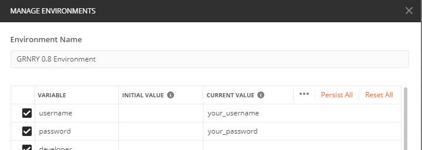
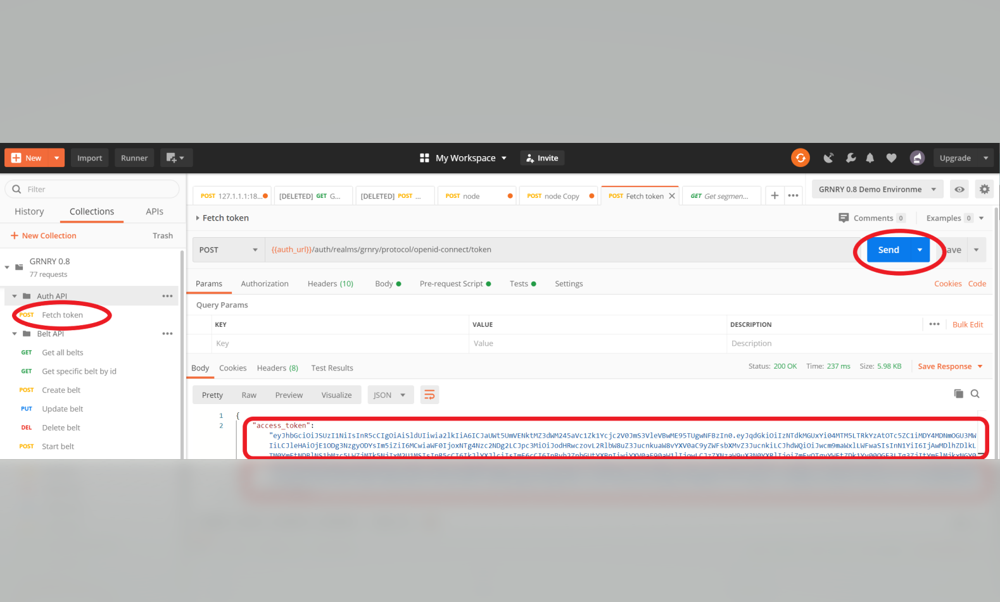

# Accessing GRNRY

## 1. Getting Access

Before we can get going, we need to gain access to the demo installation of Granary. For that please sign up or sing in to our [supportdesk](https://support.grnry.io) and [request access](https://support.grnry.io/support/catalog/items/29).  
With the provided information you can play through the examples below.

## 2. Accessing Granary

Now it is time to fire up Postman and  test the connection. 

* Make sure you have the [GRNRY collection imported](prerequisites-before-we-get-started.md#postman).
* In Postman provide your access credentials in the GRNRY environment:

  * Press the cog wheel button on the upper right 
  * Provide your username and password as current value and press update.  
  * In order to work with the API, we need to retrieve a bearer token to authenticate with the APIs. In order to do so, click "Fetch Token" and press the "Send" button as depicted below.  If successful, you should see the bearer token as also highlighted below. Now you are good to go to use all APIs until the token expires. After the token expires, simply fetch a new token. 

  Then you can start registering your data pipeline.

