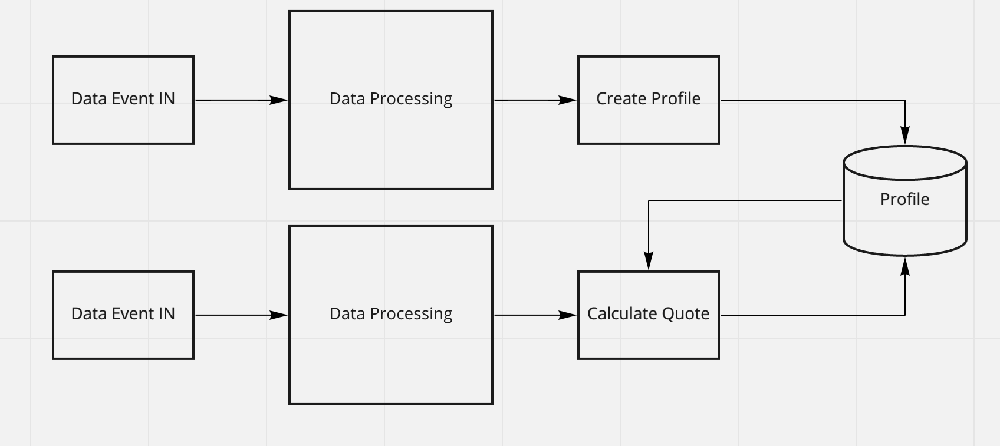

# Tutorial 1: COVID-19 Quote Calculation

## Calculate Quotation of COVID-19

Being able to calculate insurance premiums quickly and reliably is a challenge for any insurer; taking regional, even global, trends into account allows insurers to deliver the best possible quote to possible leads. In times of a global pandemic the need arises to relate the impact of COVID-19 with the calculated quote and adjust premiums accordingly.

This tutorial will guide you through an example pipeline which allows you to generate quotes in real-time, all powered by Granary.

We will access [https://covid19api.com/](https://covid19api.com) to get the latest information.

#### Pipeline Architecture Diagramm

### Create Profiles for new Leads

To be able to handle new Quote


[create-profiles-for-new-leads.md](create-profiles-for-new-leads.md)


### Request Quote


[calculate-quotes.md](calculate-quotes.md)

