# Pipeline 1: Create Profiles for new Leads

### 1. Creating Lead Event Type


In Granary, [Event Types](../../data-in/how-to-run-a-harvester/event-types.md) are the central entity to type incoming raw data.


Select 'Manage Event Types' on the left side pane which will open the following page: 

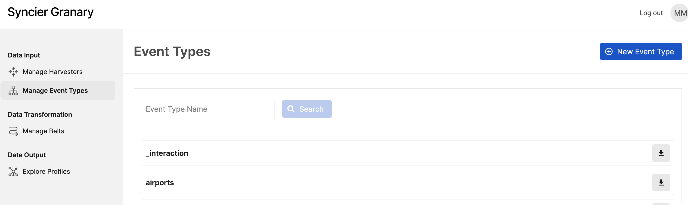

Click on 'New Event Type' button on the right side of the page. 

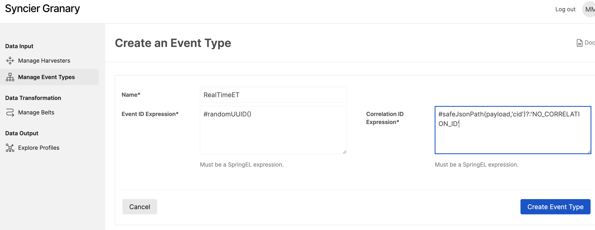

Here the configurations, you need to copy: 

> Name: `RealTimeET-<yourName>`
>
> Event ID Expression: `#randomUUID()`
>
> Correlation ID Expression: `#safeJsonPath(payload,'cid')?:'NO_CORRELATION_ID'`


Here, `‘cid’` is a part of the Snowplow event, we will be passing to Granary to test our pipeline. See a sample Snowplow event at the end of this page.


And click on button ‘Create Event Type’.

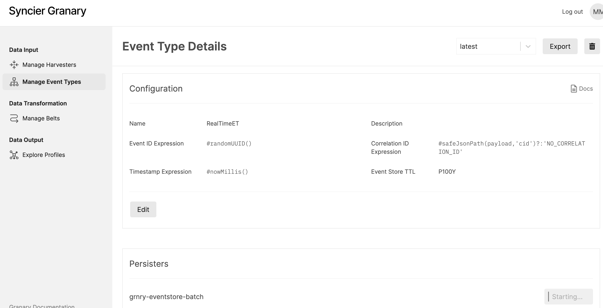

### 

### 2. Configure Harvester


In Granary, [Harvesters](../../data-in/how-to-run-a-harvester/harvesters.md) are the abstraction for data ingestion pipelines.


Select 'Manage Harvesters' on the left side pane which will open the following page:

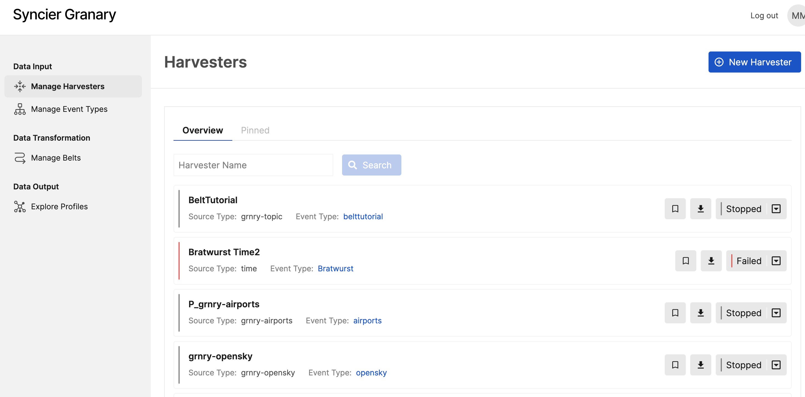

Click on the 'New Harvester' button on the right side of the pane. Provide the name of Harvester including a suffix with your name. Choose the Source Type '[Granary Topic](../../../developer-reference/dataflow/data-in/source-types.md#topic-source)' with the latest version `1.0.0`.

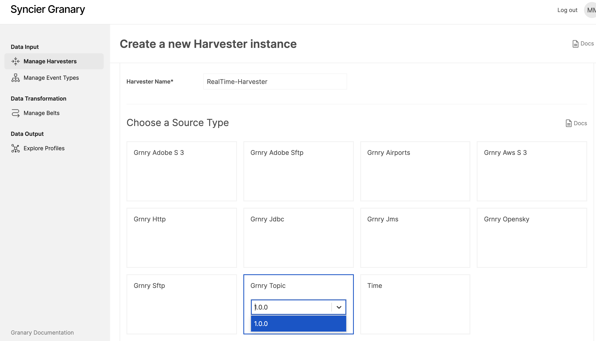

Configure the Source Type – select the default configuration as it is. I.e. we are reading data from the Snowplow API endpoint.

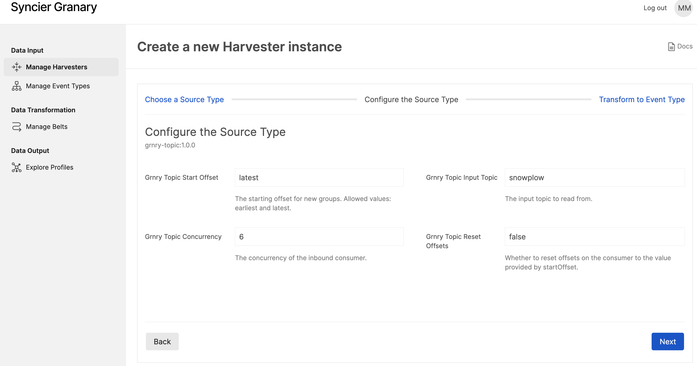

Select the Event Type `RealTimeET-<yourName>` which we have created above with the `latest` version from the drop down.   

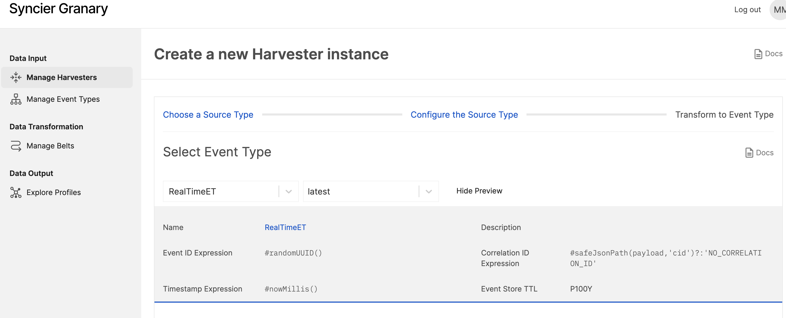

Also, we need to add a transform script like: 

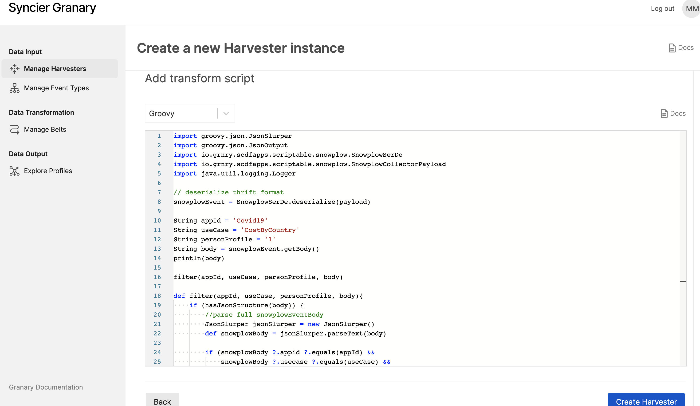

```groovy
import groovy.json.JsonSlurper
import groovy.json.JsonOutput
import io.grnry.scdfapps.scriptable.snowplow.SnowplowSerDe
import io.grnry.scdfapps.scriptable.snowplow.SnowplowCollectorPayload
import java.util.logging.Logger

// deserialize thrift format
snowplowEvent = SnowplowSerDe.deserialize(payload)

String appId = 'Covid19'
String useCase = 'CostByCountry'
String personProfile = '1'
String body = snowplowEvent.getBody()
println(body)

filter(appId, useCase, personProfile, body)

def filter(appId, useCase, personProfile, body){
    if (hasJsonStructure(body)){
        //parse full snowplowEventBody
        JsonSlurper jsonSlurper = new JsonSlurper()
        def snowplowBody = jsonSlurper.parseText(body)

        if (snowplowBody?.appid?.equals(appId) &&
            snowplowBody?.usecase?.equals(useCase) &&
            snowplowBody?.personprofile?.equals(personProfile)) {
            Logger logger = Logger.getLogger('Logger')
            logger.info('Save event for ' + appId + ': ' + body)
            return body
        }

        // event did not have the right values -> skip
        return null
    }

    // event did not have the right format -> skip
    return null
}

def hasJsonStructure(String body){
    if (body == null){
        return false
    }
    cleaned_body = body.trim()
    return cleaned_body.startsWith('{') && cleaned_body.endsWith('}')
}
```

In the transform script, we are parsing the data which we are getting from the Snowplow event. Primary goal of the script is to transform the Snowplow events from Thrift to JSON. The filter function at line 16 getting called to compares the values of `appId`, `useCase` and `personProfile = 1`, if the event contains the `personProfile` flag as `1`, then it will processed within our pipeline. Otherwise, it will be dropped.


Check the Harvester's [best practice section](../../data-in/best-practices-1/) for more scriptable transform examples.


Once the Harvester is created, It is stopped in state initially, from the left side of the screen we can see the drop down using that we need to start the Harvester.


After harvester started we can see the state is running and can search the harvester by its name: 

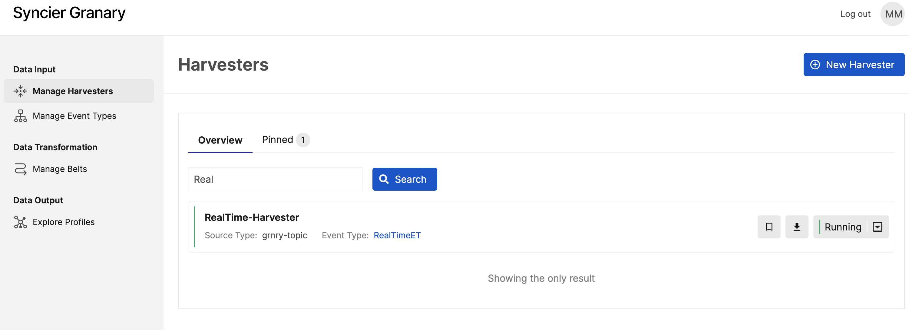

### 3. Transform events with the Belt


In Granary, a Belt is a function runtime that transforms raw events to valuable information according to business requirements. Check the [Belt runtime reference](../../../developer-reference/dataflow/belt-extractor.md) for a documentation of all its features.


Select the 'Manage Belts' section from the left side of the page and click on button 'New Belt'. Specify the name of Belt `RealTime-Belt-<yourName>` and select the Event Type `RealTimeET-<yourName>` created above. 

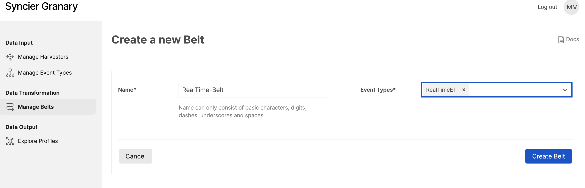

Once the Belt is created, it looks like this: 

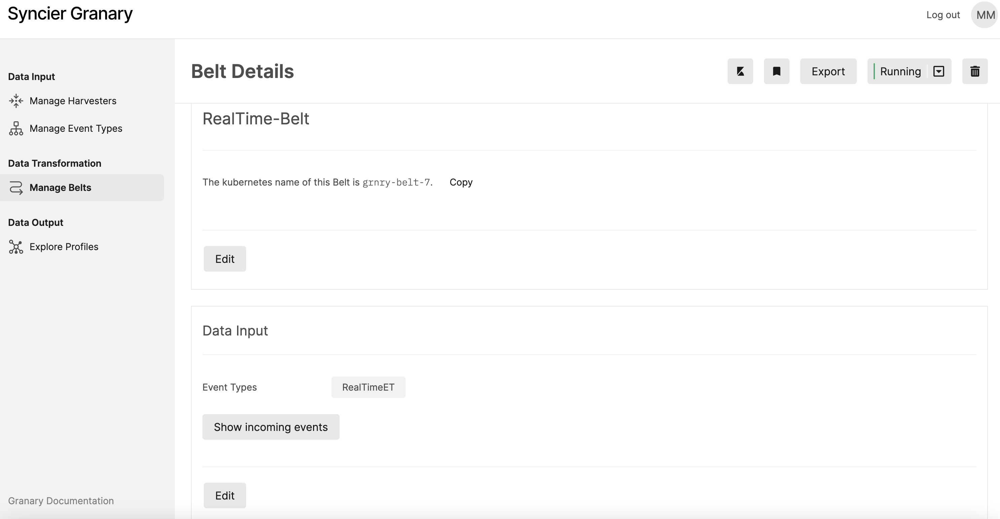

We can use Belt configuration parameters: 

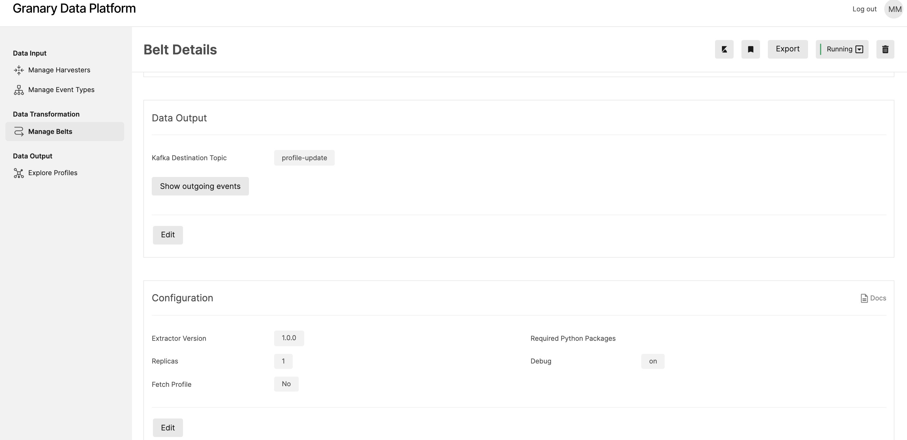

Also, we need to add a transformation function in Belt:

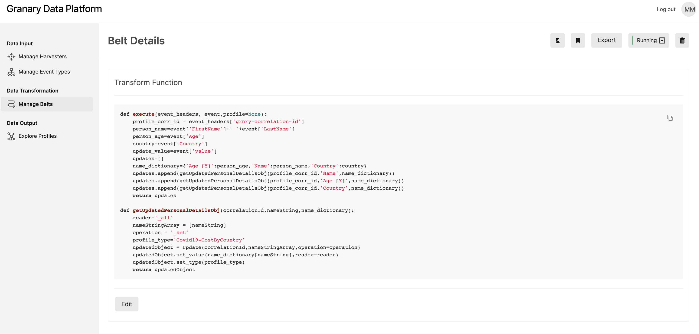

```python
def execute(event_headers, event,profile=None):   
    profile_corr_id=event_headers['grnry-correlation-id']
    person_name=event['FirstName']+' '+event['LastName']
    person_age=event['Age']
    country=event['Country']
    update_value=event['value']
    updates=[]
    name_dictionary={'Age [Y]':person_age,'Name':person_name,'Country':country}
    updates.append(getUpdatedPersonalDetailsObj(profile_corr_id,'Name',name_dictionary))
    updates.append(getUpdatedPersonalDetailsObj(profile_corr_id,'Age [Y]',name_dictionary))
    updates.append(getUpdatedPersonalDetailsObj(profile_corr_id,'Country',name_dictionary))
    return updates

def getUpdatedPersonalDetailsObj(correlationId,nameString,name_dictionary):
    reader='_all'
    nameStringArray=[nameString]
    operation='_set'
    profile_type='Covid19-CostByCountry'
    updatedObject=Update(correlationId,nameStringArray,operation=operation)
    updatedObject.set_value(name_dictionary[nameString],reader=reader)
    updatedObject.set_type(profile_type)
    return updatedObject

```

The primary goal of the Belt's transformation function is to model a Profile based on incoming raw events by creating Profile Update objects. In line 10, we create a dictionary which contains `Age`, `Person Name`, and `Country`. These are the keys of the attributes of our Profile. In Granary we call them Grain paths. These details get appended to the Profile Update object using `getUpdatedPersonalDetailsObj()` in line 11ff. In line 21, the profile gets created using the values getting passed. At line no 18, profile\_type is defined with combination of `appid`:"Covid19",  "-" and `usecase`:"CostByCountry".


Check the reference of available [Profile Update operations](../../../developer-reference/dataflow/profile-store/#component-profile-updater) as well as the Belt's [best practice section](../../using-data-in-granary/best-practices/) for more transformation function examples.


Start the Belt and check if it is in running state:

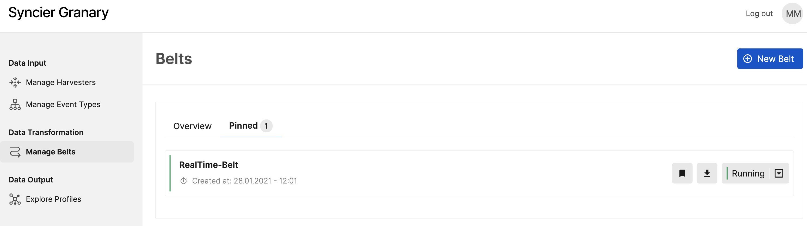

### 4. Validate with Profile Explorer

To test the pipeline, send a HTTP `POST` request with the following JSON body to the Snowplow API endpoint of demo environment \(`<host>/api/com.snowplowanalytics.snowplow/tp2`\):

```javascript
{
 "personprofile":"1",
 "appid":"Covid19",
 "usecase":"CostByCountry",
 "cid":"200909095",
 "FirstName" : "Steve",
 "LastName" : "Smith",
 "Age" : "38",
 "Country" :"SA",
 "operation" : "_set",
 "value" : "12"
}
```


You can send this event using Granary's Postman collection. See Prerequisits.


Once the Snowplow event is triggered, our Harvester will ingest the events into Granary. Then the events will be transformed via our Belt in Granary. When the Belt transforms the events, the grains \(using Profile Updates\) will get inserted into the Profile Store. Finally, we can retrieve the grains using Profile Explorer.

In Granary UI's Event Browser, we can interactively follow the journey of events through Granary. After the events received at Harvester, we can see them in the 'Data Out' Event Browser:


After the events are received at Belt, the transform function is executed and Profile Updates are written to the destination topic 'profile-update' which we can see in the 'Data Output' Event Browser:


The paths "Age \[Y\]", "Country", "Name" \(first name + last name\) with the corresponding values passed get inserted into Profile Store. Select 'Explore Profile' section on the right hand side. There we can see that the profile will look like this:

While searching the profile in Profile Explorer we need to specify : 

> Profile Type : Covid19-CostByCountry
>
> Correlation id : cid value from the postman request

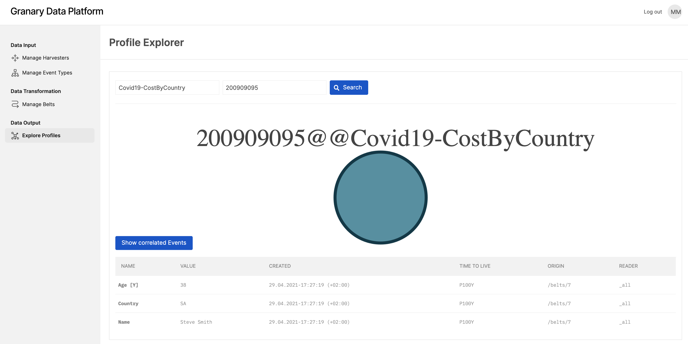



Naming of all components can be any valid string.


