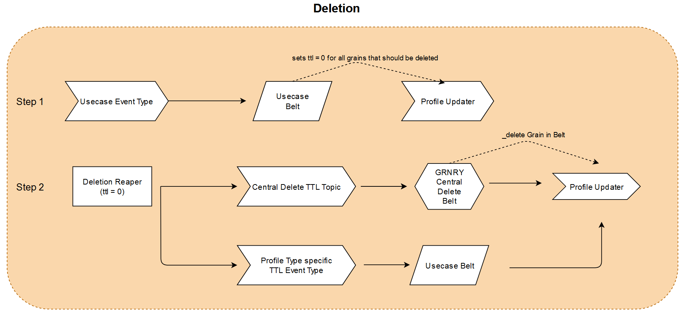

# TTL-expired Grain Processing

Time-to-live (TTL) expired Grains are picked up periodically by Granary's [Reaper](../../../developer-reference/dataflow/profile-store/reaper.md) from the Profile Store and written to TTL topics retrieved from the Grain's corresponding TTL Event Type. These Grains are then available for further processing by the Belts.

Please note that&#x20;

* Grains written to TTL Event Types are already deleted by Granary.
* in compliance with data protection laws, grains written to the TTL topics do not carry a value. If the value is needed, one has to query them from the Profile Store from within the belt, i.e., setting the `fetch_profile`parameter to true. See [Configuration](https://app.gitbook.com/@alvary/s/grnry-sd7f6g8sd68sdf7/\~/diff/drafts/-M0quiYWAmR7whC99GOZ/developer-reference/dataflow/belt-extractor#configuration/@drafts). The Correlation ID should be found in both message header and body.

## Use Case Example: Deletion Trigger

It might be desired to receive notifications about the deletion of grains in Granary to trigger actions in other systems. One way to facilitate this is to create a belt, - let's call it a deletion trigger belt -, which processes the TTL-expired grains from the topic(s) and sends triggers so that a third-party-system can delete corresponding data as well.&#x20;



### Step 1: Insert a Grain that will be reaped

The TTL in Granary profiles' grains has got the format [ISO 8601 duration](https://en.wikipedia.org/wiki/ISO\_8601#Durations). By default, a grain's TTL is `P100Y` which equals a duration of 100 years. Therefore we need to ensure that a [belt](../getting-started.md) creates a grain with a shorter duration for this use case.&#x20;

For example given this event

```javascript
{ 
    "body": {
        "cid": "Deletion82542",
        "path": "deletion/path",
        "value": "2020-05-04T10:15:42",
        "reader": "_auth",
        "type": "your-profile-type",
        "ttl": "PT5M"
    }
}
```

and given this belt function (see especially end of line 28)

```python
import json
import sys
from time import time

def makepath(stringpath):
    path=stringpath.split('/')
    return path

def lookup(dictionary,keys):
    if type(dictionary)==type(''):
        dictionary=json.loads(dictionary)
    try:
        if len(keys)>1:
            value = lookup(dictionary[keys[0]],keys[1:])
        else:
            value = dictionary[keys[0]]
        return value
    except:
        return None

def execute(event_headers, event, profile=None):
    
    event_data = lookup(event,['body'])
    if event_data is None:
        return None
    
    update = Update(event_data['cid'],makepath(event_data['path']))
    update.set_value(value=event_data['value'], reader=event_data['reader'], ttl=event_data['ttl'])
    update.set_type(event_data['type']))
    
    updates = []
    updates.append(update)
    print(updates)
    return updates
```

the [Profile Update](../../../developer-reference/dataflow/profile-store/#component-profile-updater) inserts a grain with a TTL of only 5 minutes. For an easier calcuation of ISO 8601 duration expressions, we recommend to use the version 0.6.0 of PIP library [isodate](https://pypi.org/project/isodate/).

### Step 2: Wait for Reaper to reap the Deletion Grain

The Reaper runs periodically configured via a CRON job. Depending on the next Reaper run but earliest after the five minute TTL value, the Reaper will emit our deleteion grain to two different topics. The first topic is the GRNRY internal central deletion topic which is connected to an internal belt that ensures that the grains are deleted from Profile Store. The second topic is a profile-type-specific topic `grnry_ttl_ttl-your-profile-type` where the same grain is written to allow users to act on their deletion.

Reaper's log output looks like this if grains were reaped:

```python
08:07:56.915 [main] INFO org.springframework.batch.core.launch.support.SimpleJobLauncher - Job: [SimpleJob: [name=reaper__1588579667719]] completed with the following parameters: [{}] and the following status: [COMPLETED]
***********************************************************
reaper__1588579667719 finished with a status of  (COMPLETED).
* Steps executed:
    readGrainsAndSendToKafka: 
        exitCode=COMPLETED;
        exitDescription=
StepExecution:
        id=0, 
        version=1, 
        name=readGrainsAndSendToKafka, 
        status=COMPLETED, 
        exitStatus=COMPLETED, 
        readCount=1, 
        filterCount=0, 
        writeCount=1,
        readSkipCount=0, 
        writeSkipCount=0, 
        processSkipCount=0, 
        commitCount=1, 
        rollbackCount=0
***********************************************************

```

Search the parameter `writeCount` to see how many grains were reaped during the last Reaper run.

Expired grains in the TTL topics carry the following header values:

```java
topic: "grnry_ttl_ttl-deletion"
kafka_messageKey: "correlation_id"
grnry-harvester-name: "grnry-reaper"
grnry-correlation-id: "Deletion82542"
grnry-event-timestamp: "1584708855528"
grnry-event-id: "cfcea2b7-68e1-4489-9577-1616179e6235"
grnry-event-type: "ttl-deletion"
```

and  payload:

```java
String correlationId: "Deletion82542"
String profileType: "your-profile-type"
String path: "deletion/path"
String pit: "_latest"
String grain_type: "t"
String inserted: "1569504323132"
String ttn: "P100Y"
String ttl: "PT5M"
String reader: "_auth"
String origin: "/belt123"
```

### Step 3: Deploy Belt that consumes Reaper emitted Grains

To act upon a deletion, we need to deploy a belt that consumes from the topic `grnry_ttl_ttl-deletion`. This is possible by selecting the Reaper-generated [Event Type](../../data-in/how-to-run-a-harvester/event-types.md) "ttl-deletion". These Reaper-generated Event Types are of [type](../../../developer-reference/api-reference/harvester-api/#create-an-event-type) `ttl`. In the belt callback script, the values in the `execute` function will look like this:

#### Event Headers

```javascript
{
    "grnry-harvester-name": "grnry-reaper",
    "grnry-event-type": "ttl-your-profile-type",
    "grnry-event-id": "cfcea2b7-68e1-4489-9577-1616179e6235",
    "grnry-correlation-id": "Deletion82542",
    "grnry-event-timestamp": "1584708855528"
}
```

#### Event Payload

```javascript
{
    "correlationId": "Deletion82542",
    "profileType": "deletion",
    "path": "deletion/path",
    "pit": "_latest",
    "grain_type": "t",
    "inserted": 1569504323132,
    "ttl": "PT5M",
    "ttn": "P100Y",
    "reader": "_auth",
    "origin": "/belt123"
}
```

Given the belt code below and the reaped event above, we can do the following now trigger a deletion in an external system (lines 11ff):

```python
import json
import requests


def makepath(stringpath):
    path = stringpath.split('/')[1:]
    return path

def execute(event_headers, event, profile=None):

    # Trigger
    trigger_url = "<webhook URL>"
    body = """{"@type": "MessageCard","@context": "https://schema.org/extensions","summary": "Card","themeColor": "0072C6","title": "Reaped Grain","text": "Grain got reaped: """
    body += str(event)
    body += """"}"""
    r = requests.post(url = trigger_url, data = body)
    print(r.status_code)
    
    return None
```

## Working with ISO8601 durations

In order to ease development of belts that process TTN grains, the belt framework ([Belt Extractor](../../../developer-reference/dataflow/belt-extractor.md)) provides access to the [isodate library](https://pypi.org/project/isodate/). Thus, in your belt code you can easily convert between different representations:

```python
import json
import requests
import isodate
import datetime

def execute(event_headers, event, profile=None):
    # Convert Duration object to iso8601-formatted string
    iso = isodate.duration_isoformat(isodate.Duration(weeks=6, days=3, minutes=15))
    print(type(iso))
    print(iso)
    #> <class 'str'>
    #> 'P45DT15M'
    
    # Convert Timedelta object to iso8601-formatted string
    iso = isodate.duration_isoformat(datetime.timedelta(weeks=6, days=3, minutes=15))
    print(type(iso))
    print(iso)
    #> <class 'str'>
    #> 'P45DT15M'
    
    # Convert iso8601-formatted string to Duration/Timedelta object
    d = isodate.parse_duration('P45DT15M')
    print(type(d))
    print(d)
    #> <class 'datetime.timedelta'>
    #> 45 days, 0:15:00
    
    ...
    
    return update
```

Please note that according to the documentation of the isodate library the `parse_duration` method will return either a Duration or Timedelta object, depending on the input:

> If the ISO date string does not contain years or months, a timedelta instance is returned, else a Duration instance is returned. \[[Link](https://github.com/gweis/isodate/blob/ce635a7a483effb3fc246721cfb5a8a7b5174ab5/src/isodate/isoduration.py#L61)]

For any further information please refer to the [isodate documentation](https://pypi.org/project/isodate/).
