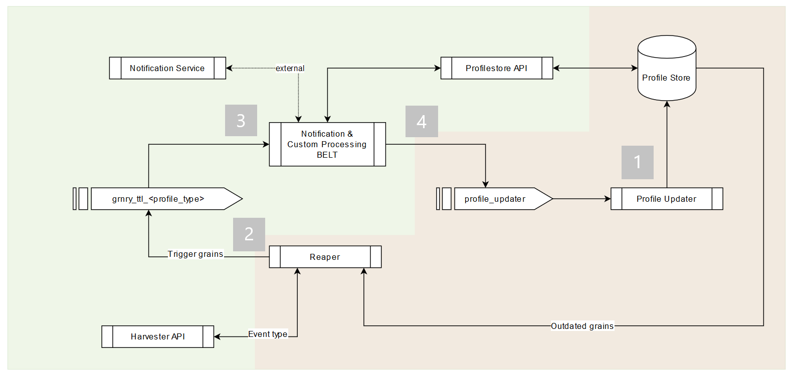

# TTL-expired Grain Processing

Time-to-live \(TTL\) expired Grains are picked up periodically by Granary's [Reaper](../../../developer-reference/dataflow/profile-store/reaper.md) from Profile Store and written to TTL topics retrieved from the Grain's corresponding TTL Event Type. These Grains are then available for further processing by the Belts.

Please note that to comply with data protection law, grains written to the TTL topics do not carry a value. If the value is needed, one has to query them from the Profile Store from within the belt, i.e setting the `fetch_profile`parameter to true. See [Configuration](https://app.gitbook.com/@alvary/s/grnry-sd7f6g8sd68sdf7/~/diff/drafts/-M0quiYWAmR7whC99GOZ/developer-reference/dataflow/belt-extractor#configuration/@drafts). The Correlation ID should be found in both message header and body.

## Use Case Example: Notification

It might be desired to receive notifications about the expiry of certain actions \(grains\). One way to facilitate this is to create a belt, - let's call it a notification belt -, which processes the TTL-expired grains from the topic\(s\) and sends notifications accordingly. 



### Step 1: Insert a Grain that will be reaped

The [TTL](../../../developer-reference/dataflow/profile-store/#table-profilestore) in Granary profiles' grains has got the format [ISO 8601 duration](https://en.wikipedia.org/wiki/ISO_8601#Durations). By default, a grain's TTL is `P100Y` which equals to a duration of 100 years. So, most likely, it will never be reaped. Therefore we need to have a [belt](../getting-started.md) that creates a grain with a shorter duration. 

For example given this event

```javascript
{ 
    "body": {
        "cid": "Feedback82542",
        "path": "notification/thankyou",
        "value": "2020-05-04T10:15:42",
        "reader": "_auth",
        "type": "feedback",
        "ttl": "PT5M"
    }
}
```

and given this belt function \(see especially end of line 29\)

```python
from grnry.beltextractor.update import Update
import json
import sys
from time import time

def makepath(stringpath):
    path=stringpath.split('/')
    return path

def lookup(dictionary,keys):
    if type(dictionary)==type(''):
        dictionary=json.loads(dictionary)
    try:
        if len(keys)>1:
            value = lookup(dictionary[keys[0]],keys[1:])
        else:
            value = dictionary[keys[0]]
        return value
    except:
        return None

def execute(event_headers, event, profile=None):
    
    event_data = lookup(event,['body'])
    if event_data is None:
        return None
    
    update = Update(event_data['cid'],makepath(event_data['path']))
    update.set_value(value=event_data['value'], reader=event_data['reader'], ttl=event_data['ttl'])
    update.set_type(event_data['type']))
    
    updates = []
    updates.append(update)
    print(updates)
    return updates
```

the Profile Updater inserts a grain with a TTL of only 5 minutes. For an easier calcuation of ISO 8601 duration expressions, we recommend to use the version 0.6.0 of PIP library [isodate](https://pypi.org/project/isodate/).

### Step 2: Wait for Reaper to reap the Notification Grain

The Reaper runs peridodically configured via a CRON job. Depending on the next Reaper run but earliest after the five minutes, the Reaper will emit our notification grain to the the topic `grnry_ttl_feedback` .

Reaper's log output looks like this if grains were reaped:

```python
08:07:56.915 [main] INFO org.springframework.batch.core.launch.support.SimpleJobLauncher - Job: [SimpleJob: [name=reaper__1588579667719]] completed with the following parameters: [{}] and the following status: [COMPLETED]
***********************************************************
reaper__1588579667719 finished with a status of  (COMPLETED).
* Steps executed:
    readGrainsAndSendToKafka: 
        exitCode=COMPLETED;
        exitDescription=
StepExecution:
        id=0, 
        version=3, 
        name=readGrainsAndSendToKafka, 
        status=COMPLETED, 
        exitStatus=COMPLETED, 
        readCount=9, 
        filterCount=0, 
        writeCount=9,
        readSkipCount=0, 
        writeSkipCount=0, 
        processSkipCount=0, 
        commitCount=1, 
        rollbackCount=0
***********************************************************

```

Search the parameter `writeCount` to see how many grains were reaped during the last Reaper run.

Expired grains in the TTL topics carry the following header values:

```java
topic: "grnry_ttl_feedback"
kafka_messageKey: "feedback"
grnry-harvester-name: "grnry-reaper"
grnry-correlation-id: "Feedback82542"
grnry-event-timestamp: "1584708855528"
grnry-event-id: "cfcea2b7-68e1-4489-9577-1616179e6235"
grnry-event-type: "feedback"
```

and  payload:

```java
String correlationId: "Feedback82542"
String profileType: "feedback"
String path: "notification/thankyou"
String pit: "_latest"
String grain_type: "t"
String inserted: "1569504323132"
String ttl: "PT5M"
String reader: "_auth"
String origin: "/belt123"
```

### Step 3: Deploy Belt that consumes Reaper emitted Grains

To act upon a notification, we need to deploy a belt that consumes from the topic `grnry_ttl_feedback`. This is possible by selecting the Reaper-generated [Event Type](../../data-in/how-to-run-a-harvester/event-types.md) "feedback". These Reaper-generated Event Types are of [type](../../../developer-reference/api-reference/harvester-api/#create-an-event-type) `ttl`. In the belt callback script, the values in the `execute` function will look like this:

#### Event Headers

```javascript
{
    "grnry-harvester-name": "grnry-reaper",
    "grnry-event-type": "feedback",
    "grnry-event-id": "cfcea2b7-68e1-4489-9577-1616179e6235",
    "grnry-correlation-id": "Feedback82542",
    "grnry-event-timestamp": "1584708855528"
}
```

#### Event Payload

```javascript
{
    "correlationId": "Feedback82542",
    "profileType": "feedback",
    "path": "notification/thankyou",
    "pit": "_latest",
    "grain_type": "t",
    "inserted": 1569504323132,
    "ttl": "PT5M",
    "reader": "_auth",
    "origin": "/belt123"
}
```

Given the belt code below and the reaped event above, we can do the following:

* Notify some external system \(lines 13ff\)
* Update the grain's TTL or delete the grain in the Profile Store \(lines 21ff\)

```python
from grnry.beltextractor.update import Update
from grnry.beltextractor.update import DELETE_OPERATION
import json
import requests


def makepath(stringpath):
    path = stringpath.split('/')[1:]
    return path

def execute(event_headers, event, profile=None):

    # Notification
    notification_url = "<webhook URL>"
    body = """{"@type": "MessageCard","@context": "https://schema.org/extensions","summary": "Card","themeColor": "0072C6","title": "Reaped Grain","text": "Grain got reaped: """
    body += str(event)
    body += """"}"""
    r = requests.post(url = notification_url, data = body)
    print(r.status_code)
    
    # Profile Update
    e = event
    update = Update(e['correlationId'], makepath(e['path']), operation=DELETE_OPERATION)\
        .set_value(value=[e['pit']], origin=e['origin'], reader="_auth")\
        .set_type(e['profileType'])
    print(update)
    return update
```

### Step 4: Ensure idempotency

It is, however, worth mentioning that since those expired grains are read from the [Profile Store](../../../developer-reference/dataflow/profile-store/) and written periodically into the topics, they will appear multiple times if they weren't previously processed, resulting in multiple notifications being dispatched. 


We therefore advise a notification belt to also trigger a delete operation on the expired grains being processed, to ensure that they will not be read twice.


## Working with ISO8601 durations

In order to ease development of belts that process TTL grains, the belt framework \([Belt Extractor](../../../developer-reference/dataflow/belt-extractor.md)\) provides access to the [isodate library](https://pypi.org/project/isodate/). Thus, in your belt code you can easily convert between different representations:

```python
import json
import requests
import isodate
import datetime

def execute(event_headers, event, profile=None):
    # Convert Duration object to iso8601-formatted string
    iso = isodate.duration_isoformat(isodate.Duration(weeks=6, days=3, minutes=15))
    print(type(iso))
    print(iso)
    #> <class 'str'>
    #> 'P45DT15M'
    
    # Convert Timedelta object to iso8601-formatted string
    iso = isodate.duration_isoformat(datetime.timedelta(weeks=6, days=3, minutes=15))
    print(type(iso))
    print(iso)
    #> <class 'str'>
    #> 'P45DT15M'
    
    # Convert iso8601-formatted string to Duration/Timedelta object
    d = isodate.parse_duration('P45DT15M')
    print(type(d))
    print(d)
    #> <class 'datetime.timedelta'>
    #> 45 days, 0:15:00
    
    ...
    
    return update
```

Please note that according to the documentation of the isodate library the `parse_duration` method will return either a Duration or Timedelta object, depending on the input:

> If the ISO date string does not contain years or months, a timedelta instance is returned, else a Duration instance is returned. \[[Link](https://github.com/gweis/isodate/blob/ce635a7a483effb3fc246721cfb5a8a7b5174ab5/src/isodate/isoduration.py#L61)\]

For any further information please refer to the [isodate documentation](https://pypi.org/project/isodate/).

