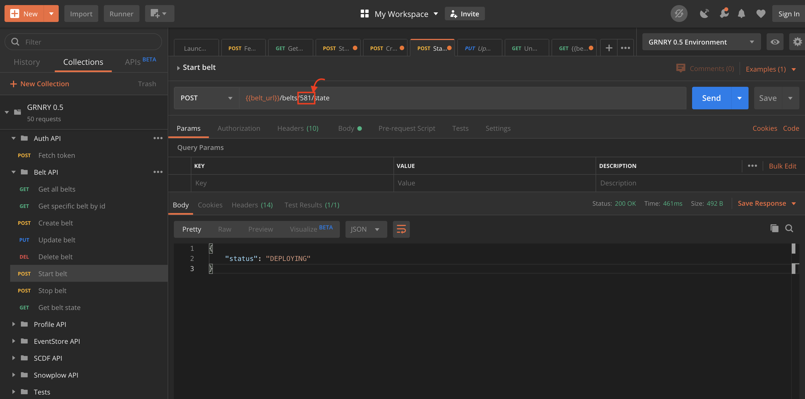
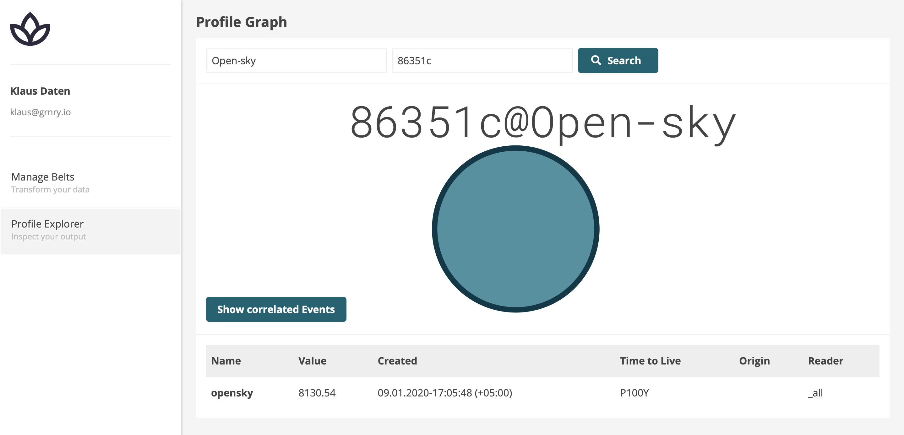

# How to run a Belt

In order to use Belts with GRNRY, there are two different approaches:

1. Use the [Belt API](../../developer-reference/api-reference/belt-api.md) via [Postman](https://learning.postman.com) (an API development tool)
2. Use the "Manage Belts" section of Granary UI available under `<URL to Cluster>/ui/belts`

In the following, we are going to describe the usage of Belt API with a Postman collection.&#x20;


This guide assumes that you have the `editor` role in `global` project. If you want to create the objects in a different project scope, you need to add /projects/{projectName} in front of all your API calls. Exception: Profilestore and Eventstore API calls.


Now, we are going to give you a walk through the whole process of creating belts using the Belt API. The example used is of Opensky Network. You will see how easy it is to create a belt with some simple python based scripts. Afterwards, we are going to have a more detailed look at Granary's enhancements for Belts and describe ways to configure your deployments. It is assumed that you have a running Granary instance and all the data from the harvesters has been already published on the Kafka topic.

Please, pay also attention to our [hints on naming Belts](best-practices/hints-on-naming-of-belts.md).

## BELT Operations through Postman Collection

In order to use the Postman collection, its values and environment variables need to be set first. Postman collection values can be downloaded from [here](../../developer-reference/api-reference/#postman-collection). A Granary instance will be visible then in the Postman collection showing various endpoint APIs that are part of the Granary platform. Adjust them to your environment's URLs.

After we have authorized our token, we can start with creating belts. A more detailed explanation for the Belt API can be found [here](../../developer-reference/api-reference/belt-api.md) which shows various operations which can be performed with the belts. The JSON based input required to create a belt can be seen here:

.png>)

The different arguments seen are the basic required for creating a Belt. In line 4, the extractor function takes a python code as a one-liner which performs the transformations on the input data from the Kafka topic. Line 5 points to the Kafka topics from where the belt needs to read data. The Belt can read from one or more than one Kafka topics, depending on the functionality to be implemented. The rest of the properties can be seen on the above mentioned link for the Belt API. The following is the output after the Belt is created:

```
{
    "version": "1",
    "name": "airplane-belt27",
    "description": "Airplane belt",
    "labels": [],
    "replicas": 1,
    "millicpu": 200,
    "memory": 512,
    "created": 1578685444972,
    "requirementsPy": "",
    "extractorVersion": "2.1.3",
    "extractorFn": "import json\nimport sys\ndef lookup(dictionary,keys):\n    if type(dictionary)==type(''):\n        dictionary=json.loads(dictionary)\n    try:\n        if len(keys)>1:\n            value = lookup(dictionary[keys[0]],keys[1:])\n        else:\n            value = dictionary[keys[0]]\n        return value\n    except:\n        return None\n\ndef execute(event_headers, event_payload, profile = None):\n    update = []\n    correlation_id= event_headers['grnry-correlation-id']\n    geoAltitude=event_payload['geoAltitude']\n    payload= lookup(profile,['jsonPayload'])\n    opensk = lookup(payload,['openksy'])\n    latest = lookup(opensk,['_latest'])\n    value = lookup(latest,['_v'])\n    update = Update(correlation_id, ['opensky']).set_value(value=[str(event_payload['geoAltitude'])],_in=int(event_payload['lastContact']), reader='_all')\n    update.set_type('opensky')\n    return update",
    "eventTypes": [
        "opensky"
    ],
    "partitionOffsets": {},
    "kafkaDestinationTopic": "profile-update",
    "beltType": "python-callback",
    "debug": false,
    "fetchProfile": "TRUE",
    "profileType": "Open-sky",
    "secret": "belt-user",
    "secretUsername": "username",
    "secretPassword": "password",
    "status": "STOPPED",
    "volumes": null,
    "volumeMounts": null,
    "extraEnv": null,
    "kubernetesName": "grnry-belt-581",
    "id": "581"
}
```

The output of creating a Belt assigns an `id` number to the Belt. This `id` can be viewed in line 30 above. The next step is to start the already created Belt. For that purpose we will put the `id` in the POST for Start belt. The immediate response seen shows that the Belt is now getting deployed. Now a pod will be visible on the Kubernetes cluster for this particular Belt. The following image shows how to start a Belt with an indicator for where to put the `id` number of the Belt:



Similarly, the Belt's `id` is also used to stop a Belt which has already been deployed on the cluster. The following image illustrates how to stop a Belt with an indicator for where to put the `id` number of the Belt:

 (1).png>)

These are all steps to create and start a Belt to transform incoming data. Check out the [event types](../../developer-reference/dataflow/event-type.md) page to see which are valid input and output event types.


Changing the Belt's configuration again will yield a "Running but outdated" state. Restart the Belt to apply the changes.


See the [COVID-19 Tutorial](../tutorials/tutorial-covid-19-quote/) for a Granary UI based way of creating belts.

## Profile Store

The Belt update operations result in Profile Store mutations. There are various sort of settings which can be applied on the profiles. A detailed documentation for the various sort of profile updates can be seen [here](../../developer-reference/dataflow/profile-store/#table-profilestore). The Belts we created earlier result in the following profile updates:

.png>)

After the profile updates are seen in the Profile Store, we can verify the profiles through the Profile Explorer, which is part of the Granary UI. It requires the `profile_type` and the `correlation_id`, with which we can see the profile graph and the attributes of the specific profile.


