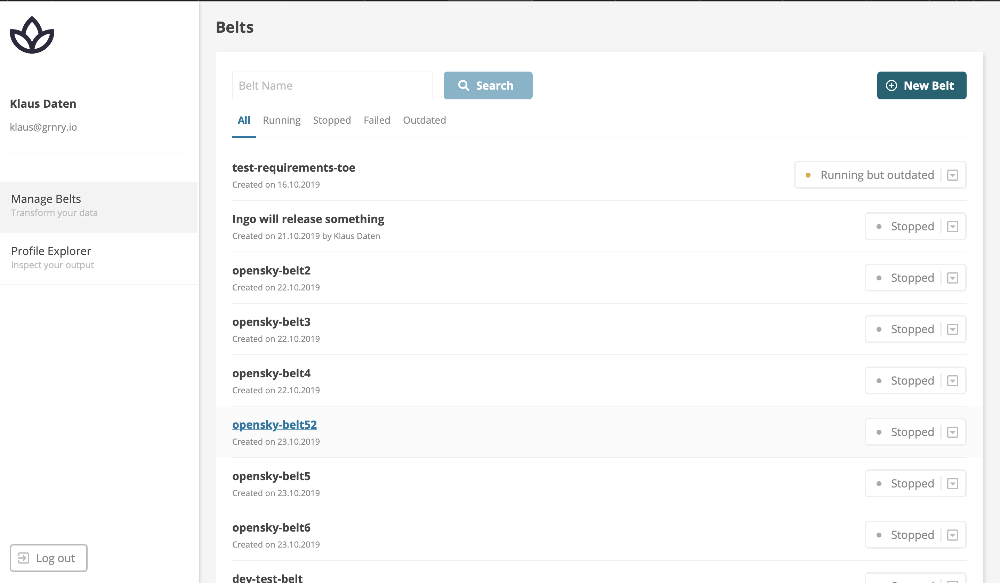
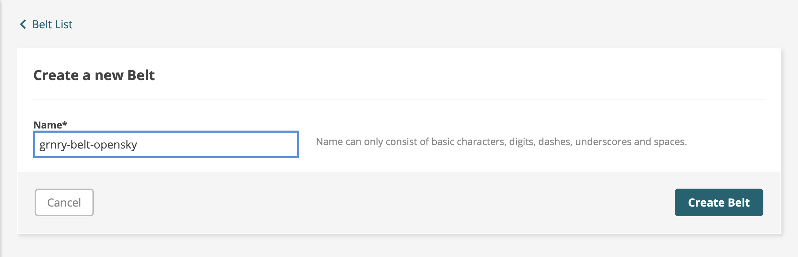
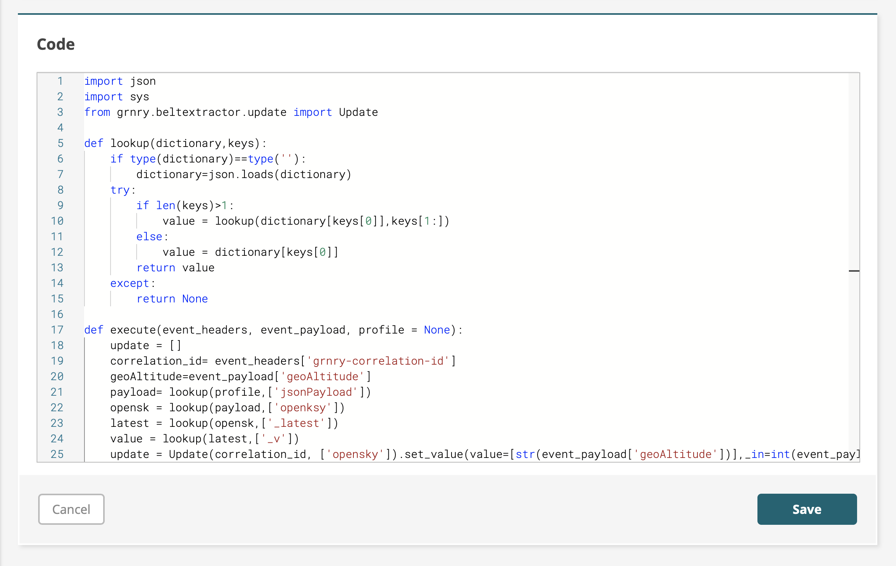
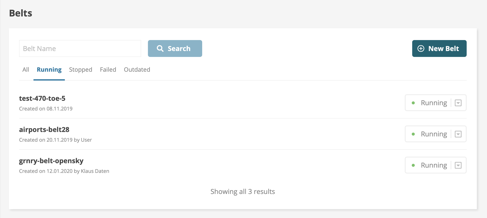

# How to run a Belt

In order to use Belts with GRNRY, there are two different approaches:

1. Use the [Belt API](../../developer-reference/api-reference/belt-api.md) via [Postman](https://learning.postman.com/) \(an API development tool\)
2. Use the "Manage Belts" section of Granary UI available under `<URL to Cluster>/ui/belts`

In the following, we are going to describe the usage of Belt API through the Granary UI and Postman collection. However, you should know, that everything you do is available through the Belt API.

Now, we are going to give you a walk through the whole process of creating belts using the Belt API. The example used is of Opensky Network. You will see how easy it is to create a belt with some simple python based scripts. Afterwards, we are going to have a more detailed look at Granary's enhancements for Belts and describe ways to configure your deployments. It is assumed that you have a running Granary instance and all the data from the harvesters has been already published on the Kafka topic.

## BELT Operations through Postman Collection

In order to use the Postman collection, its values and environment variables need to be set first. Postman collection values can be downloaded from [here](../../developer-reference/api-reference/#postman-collection). A Granary instance will be visible then in the Postman collection showing various endpoint APIs that are part of the Granary platform. Adjust them to your environment's URLs. The first step is to get a token which is valid for five mins to access various APIs.

After we have authorized our token, we can start with creating belts. A more detailed explanation for the Belt API can be found [here](../../developer-reference/api-reference/belt-api.md) which shows various operations which can be performed with the belts. The JSON based input required to create a belt can be seen here:


The different arguments seen are the basic required for creating a Belt. In line 4, the extractor function takes a python code as a one-liner which performs the transformations on the input data from the Kafka topic. Line 5 points to the Kafka topics from where the belt needs to read data. The Belt can read from one or more than one Kafka topics, depending on the functionality to be implemented. The rest of the properties can be seen on the above mentioned link for the Belt API. The following is the output after the Belt is created:

```text
{
    "version": "1",
    "name": "airplane-belt27",
    "description": "Airplane belt",
    "labels": [],
    "affectedPaths": [],
    "replicas": 1,
    "millicpu": 200,
    "memory": 512,
    "author": "",
    "reader": [
        "_auth"
    ],
    "editor": [
        "belt_edit"
    ],
    "viewer": [
        "belt_view"
    ],
    "created": 1578685444972,
    "assumedRole": "",
    "requirementsPy": "",
    "extractorVersion": "",
    "extractorFn": "import json\nimport sys\nfrom grnry.beltextractor.update import Update\n\ndef lookup(dictionary,keys):\n    if type(dictionary)==type(''):\n        dictionary=json.loads(dictionary)\n    try:\n        if len(keys)>1:\n            value = lookup(dictionary[keys[0]],keys[1:])\n        else:\n            value = dictionary[keys[0]]\n        return value\n    except:\n        return None\n\ndef execute(event_headers, event_payload, profile = None):\n    update = []\n    correlation_id= event_headers['grnry-correlation-id']\n    geoAltitude=event_payload['geoAltitude']\n    payload= lookup(profile,['jsonPayload'])\n    opensk = lookup(payload,['openksy'])\n    latest = lookup(opensk,['_latest'])\n    value = lookup(latest,['_v'])\n    update = Update(correlation_id, ['opensky']).set_value(value=[str(event_payload['geoAltitude'])],_in=int(event_payload['lastContact']), reader='_all')\n    update.set_type('opensky')\n    return update",
    "eventTypes": [
        "opensky"
    ],
    "partitionOffsets": {},
    "kafkaDestinationTopic": "profile-update",
    "beltType": "",
    "runtime": "",
    "parameter": "",
    "debug": false,
    "fetchProfile": "TRUE",
    "profileType": "Open-sky",
    "secret": "belt-user",
    "secretUsername": "username",
    "secretPassword": "password",
    "status": "STOPPED",
    "volumes": null,
    "volumeMounts": null,
    "extraEnv": null,
    "kubernetesName": "grnry-belt-581",
    "id": "581"
}
```

The output of creating a Belt assigns an `id` number to the Belt. This `id` can be viewed in line 44 above. The next step is to start the already created Belt. For that purpose we will put the `id` in the POST for Start belt. The immediate response seen shows that the Belt is now getting deployed. Now a pod will be visible on the Kubernetes cluster for this particular Belt. The following image shows how to start a Belt with an indicator for where to put the `id` number of the Belt:


Similarly, the Belt's `id` is also used to stop a Belt which has already been deployed on the cluster. The following image illustrates how to stop a Belt with an indicator for where to put the `id` number of the Belt:


## BELT Operations through Granary UI

For ease of development and deployment of the Belts, the Granary platform includes a UI. We are going to see the operations which we can perform through the Granary UI on Belts. The Belt Manager page looks like this:



Clicking on the new Belt button leads us to the creation of a Belt which can be seen here: 



By clicking "Create Belt", the Belt is being created and we are being redirected to the configuration page where we can write actual Belt code, change the configuration settings and then deploy the Belt. Firstly, the name of the Belt can be edited from here and also if required a description of the functionality of the Belt can be added here. The Belt's name must be unique and must adhere to the field's description:



Do not forget to hit the "Save" button.


The next step is to provide the required configurations for the Belt to run. Starting from the "Event Types", here we provide the Kafka topics to read from, it can be either one topic or multiple. The attribute "Fetch Profile" is whether to get the profile with matching `profile_type` and `correlation_id` from the Profile Store. Here we have three possibilities, which are explained in detail on Belt Extractor page within the Data Flow documentation. In case the "Fetch Profile" is set to `true` or `lazy`, we need to provide the Kubernetes secrets containing the username and password for Profile Store API. The secret's keys for username and password properties can be configured as well. All these properties can be seen here:



Do not forget to hit the "Save" button.


After the configurations have been set, now the python code for the Belts has to be inserted inside the code block. Main goal of the function is to trigger Profile Store update operations. More information about how to write the execute function can be seen [here](../../developer-reference/dataflow/belt-extractor.md#callback-signature). This is how the code should be structured:




Do not forget to hit the "Save" button.


After all the prerequisites for the Belt creation have been done, we can verify once by clicking at the "Show Belt JSON" button. It will show us a JSON based file verifying all the configurations and the code used for creating the belt. Now we need to start the Belt in order to deploy it on the cluster. For this purpose we will click the button named as stopped and change it to start. The following illustration shows how to start a Belt:


We can go back on the main page and now see that our belt has been shifted to running mode. A Kubernetes pod would reflect this Belt in the Kubernetes cluster.  The Belt we just created can be seen to be running now:



In case of stopping the Belt, the running button has to be pressed and move the Belt to stop.


Changing the Belt's configuration again will yield a "Running but outdated" state. Restart the Belt to apply the changes.


## Profile Store

The Belt update operations result in Profile Store mutations. There are various sort of settings which can be applied on the profiles. A detailed documentation for the various sort of profile updates can be seen [here](../../developer-reference/dataflow/profile-store/#table-profilestore). The Belts we created earlier result in the following profile updates:


After the profile updates are seen in the Profile Store, we can verify the profiles through the Profile Explorer, which is part of the Granary UI. It requires the `profile_type` and the `correlation_id`, with which we can see the profile graph and the attributes of the specific profile.


