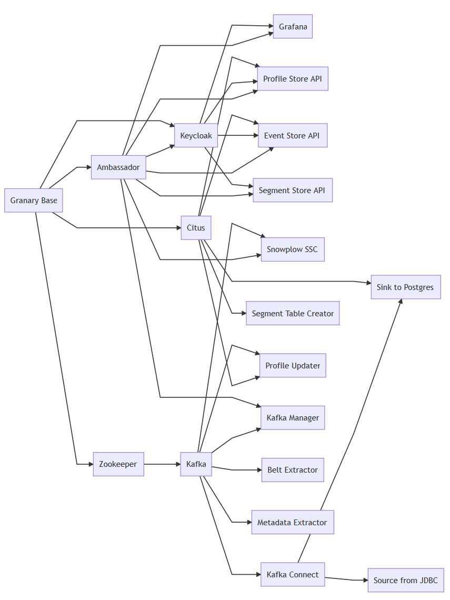

# Installation

## Helm Chart Repositories

Stable Helm Charts are to be used for deployment of Granary components with a release version tag \(see [Granary Release Notes](../granary-release-notes.md)\). Whereas Incubator Helm Chart Repo always deploys the latest commit on the master branch of the respective Granary component. Thus, the charts might be under development and change quickly over time.

#### Stable Helm Chart Repo

`helm repo add grnry-stable https://helm.grnry.io/stable` 

#### Incubator Helm Chart Repo

`helm repo add grnry-incubator https://helm.grnry.io/incubator`

## Prerequisites

* Kubernetes 1.10.0+ cluster up and running 
* Kubernetes Namespace set in ~/.kube/config 
* Helm/Tiller 2.10.0+ installed \(local & cluster\) 
* Granary Stable Helm Repo added to Tiller
* Have a default storage class set in Kubernetes

## Assumptions

* There is a [Prometheus Server](https://prometheus.io/) available to scrape the component's metric endpoint.
* There is a [Cert-Manager](https://docs.cert-manager.io/en/latest/) daemon avaiable to provide SSL certificate to Ambassador routes.
* There is basic Granary configuration deployed, see [Granary Base Helm Chart](https://gitlab.alvary.io/grnry/deployment/tree/master/charts/incubator/grnry-base).

## Deployment Dependencies

