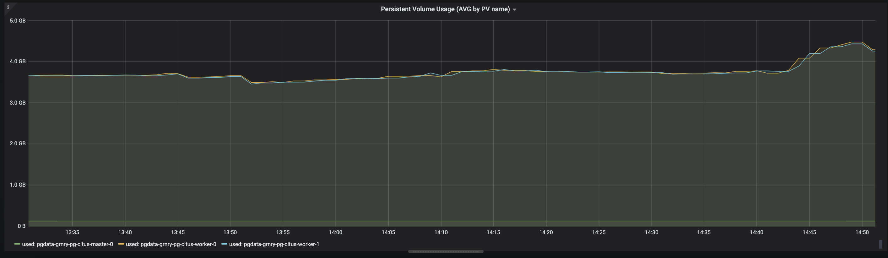

# PostgreSQL

## DB Backup and Recovery

The following shows the setup of a database backup using Barman. This allows a point-in-time recovery with zero data loss.

Basic architecture looks like this: A Barman backup node per Postgres node \(this case is demonstrated here, Barman supports backup of multiple servers in one node\).


Barman streams physical backups from the postgres node, which can be seen as snapshots in time of the data. Then WAL \(write ahead logs\) files get streamed to the barman node. This allows the recovery of the state of the data at any point in time by reconstructing from the WAL files based off of a physical backup.

### General Recommendations

* Install Barman on a dedicated server.
* Do not share the same storage with your PostgreSQL server!
* Integrate Barman with your monitoring infrastructure
* Try to keep it simple
* Test everything before you deploy it to production

Barman has two main backup strategies: streaming and bulk backup.

Barman uses _pg\_basebackup_ to stream backup data. Thus, incremental backup, parallel backup, deduplication, and network compression are not available. Use bulk backup \(ssh/rsync\) if the network is a bottleneck. _Pg\_basebackup_ is easier to setup and facilitates point-in-time recovery with zero data loss.

This quick-start sets up streaming replication following [http://docs.pgbarman.org/release/2.8](http://docs.pgbarman.org/release/2.8).

### System requirements

* Linux/Unix
* Python &gt;= 3.4
* Python modules:
  * argcomplete
  * argh &gt;= 0.21.2
  * psycopg2 &gt;= 2.4.2
  * python-dateutil
  * setuptools
* PostgreSQL &gt;= 8.3
* rsync &gt;= 3.0.4 \(optional for PostgreSQL &gt;= 9.2\)

Recovery requirements:

* Identical hardware architecture
* Identical major version of PostgreSQL
* Recommended to use the same OS, the same PG version, the same disk layout
* Time must be synchronised between the servers, e.g. using NTP, for PIT recovery

### How to _backup_ your Postgres node

####  On your postgres node

* Accept streaming replication connections from the Barman server. Authorize barman in `pg_hba.conf` file: `host replication all <IP> trust`
* Set `wal_level=’replica’` \('hot\_standby' for PostgreSQL &lt; 9.6\) in `postgresql.conf`, restart postgres instance afterwards!
* Recommended: Have seperate PostgreSQL user for streaming replication for barman \(defined in `streaming_conninfo` in server config file, we use the same user here for simplicity\)

#### On your barman node

This [installation script](/grnry/disaster-recovery-sandbox/blob/scrum%23266-demo-backup-server/barman/barman-setup.sh) can be used to setup barman on a dedicated node. Detailed explanation follows.

Illustrated using a postgres node called `pg` and a backup node called `barman`. The latter pulls the backup and stores it locally. For higher redundancy, the backup can additionally be copied to an abitrary remote location, such as S3.

* `root@barman$ apt-get install barman`
* Example main configuration file \(in `/etc/barman.conf` by default\):

```text
	[barman] *# Specifying as global settings*
	barman_user = postgres *# User name running Barman on the barman node*
	configuration_files_directory = /etc/barman.d *# Location of server config files (next step)*
	barman_home = /home/postgres *# Barman's main directory*
	log_file = ''
	log_level = DEBUG
	compression = gzip
	basebackup_retry_times = 10
```

* Example server configuration file, one for each server to be backed up by Barman \(in `/etc/barman.d`, must have `.conf` suffix\):

```text
	[pg] # Node identifier for barman
	description =  'PG-Node replication'
	backup_method = postgres # Sets backup method to streaming replication
	streaming_archiver = on
	streaming_archiver_batch_size = 50
	streaming_conninfo = host=pg user=postgres password=1234 port=5432 # PG connection for WAL streaming
	conninfo = host=$pg dbname=postgres user=postgres password=1234 port=5432 connect_timeout=20 # PG connection for maintenance
	slot_name = 'barman_backup' # Replication slot name on postgres server. WAL files will not be removed until consumed by this slot
	backup_directory = /var/backup # Where to store the backup
	retention_policy = RECOVERY WINDOW OF 30 DAYS
```

* Verify the connection with

  `postgres@barman$ psql -U postgres -h pg -c "IDENTIFY_SYSTEM" replication=1`

* Create replication slot on pg node:

  `postgres@barman$ barman receive-wal --create-slot pg`

* In order to be able to pull a backup, the current log file has to be closed using:

  `postgres@barman$ barman switch-wal --force --archive --archive-timeout 5 pg`

* Pull a physical base backup:

  `postgres@barman$ barman backup pg`

* Ensure backup works by listing backups:

  `postgres@barman$barman list-backup pg`

* Configure a cron job calling `barman cron` \(ensures WAL streaming is running\) and optionally pulling a base backup \(see above\)

### How to _restore_ your Postgres node

Barman will recreate the data directory on your postgres node by connecting to it via SSH. If using a target data directory where a PostgreSQL instance is running, stop it before issuing the recovery. Alternatively, choose a different directory and start a new instance from that folder after recovery.

####  On your postgres node

* SSH Server must be running
* Stop postgres instance \(or choose a new data directory\)
* Wait for barman \(see below\)
* Restart postgres from restored directory

####  On your barman node

* Be able to SSH passwordless to the postgres node: Have ssh key for the barman user in the `<barman_user_home>/.ssh/authorized_keys` file on your postgres node
* Choose a base backup **before** \(but close to\) the point in time which you want to recover:
  *  `barman list-backup pg` and select &lt;_backup\_id_&gt; \(highlighted in bold here\) **0190628T125307** - Fri Jun 28 12:53:08 2019 - Size: 23.5 MiB - WAL Size: 133.5 KiB
  * Or use `first` as &lt;_backup\_id_&gt; \(the closer the physical backup is to the chosen PIT, the faster the recovery process will be\)
*  `postgres@barman$ barman recover <SERVER_NAME> <BACKUP_ID> <PG_DATA_DIR> --target-time "2019-06-28 13:00:00.0" --remote-ssh-command="ssh <PG_HOST>"`
  * &lt;SERVER\_NAME&gt;: internal server name used by barman \(here: pg\)
  * &lt;BACKUP\_ID&gt; as described above
  * &lt;PG\_DATA\_DIR&gt;: Path to postgres directory you want to restore \(can be empty\)
  * &lt;PG\_HOST&gt;: Hostname of your postgres node

## Storage

When inserting/updating many grains, one can expect substantial profilestore growths \(not only proportional to the number of grain inserts\). This is because, Postgres does not immediately delete updated rows. Instead, it marks such rows as dead and adds the new version to the table.  

Therefore, we suggest to configure the profilestore table with the autovacuum settings depicted below. [https://www.postgresql.org/docs/11/routine-vacuuming.html](https://www.postgresql.org/docs/11/routine-vacuuming.html) 

```sql
ALTER TABLE profilestore
SET (autovacuum_enabled = true,
autovacuum_vacuum_scale_factor = 0.001,  
autovacuum_analyze_scale_factor = 0.005,
autovacuum_vacuum_cost_limit = 1000,
autovacuum_vacuum_cost_delay = 5,
autovacuum_analyze_threshold = 10
);
```

The following figures show the difference with/out modified autovacuum settings. The second figure clearly shows lower space consumption and more stable behavior.




In any case, we recommend to closely monitore the database.

Finally, for the disaster case when the disk is full and Postgres does not work \(e.g. [VACUUM FULL](https://www.postgresql.org/docs/11/sql-vacuum.html) cannot run\), we suggest to place some dummy file \(say 500MB\) on the volumes where the database stores its data files. Sounds weird, but one can easily remove that dummy file in case of full disks and enable the database to function again.


