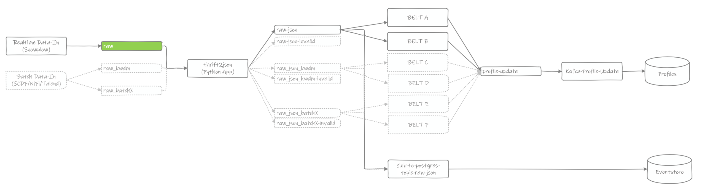

# Topic: raw

A Kafka Topic that holds event data produced by the Snowplow Collector endpoint. This data is Thrift encoded and encrypted using a key provided by the Granary Operator.

| Metadata Fields | Payload Fields | Description |
| :--- | :--- | :--- |
| key |  | uuid created by Snowplow Kafka Producer |
| value |  | Payload written by Snowplow |
|  | _schema_ | Snowplow Event Schema Reference |
|  | _ipAddress_ | ipAddress if Snowplow is configured to collect this |
|  | _timestamp_ | time of event creation or reception\(?\) |
|  | _collector_ | identifies the  |
|  | _body_ | Snowplow Event Data \(depending on _schema_\) |
|  | _headers_ | HTTP headers |
|  | _networkUserId_ | CookieID or MAID depending on event source |

